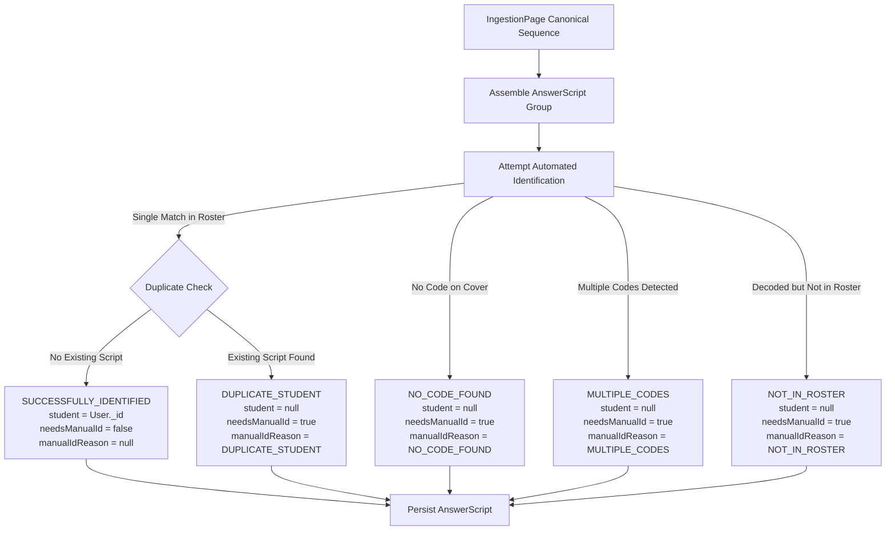

# AE-053: Confidence + Fallback Flag

## 1. Overview & Core Philosophy
AE-053 establishes the confidence classification and fallback flag contract for student assignment ingestion.

### Core Persistence Guarantee
**Every assembled answer script MUST be persisted.**
Identification failure or ambiguity must **never** cause AnswerScript creation to fail, abort batch ingestion, or discard student submissions. Unidentified submissions are persisted with `student: null`, `needsManualId: true`, and an explicit machine-readable `manualIdReason`.

---

## 2. Required Processing Order


---

## 3. The Five Explicit Identification Outcomes

| Outcome | Trigger Condition | `student` | `needsManualId` | `manualIdReason` | `candidateStudentId` |
| :--- | :--- | :--- | :--- | :--- | :--- |
| **A. `SUCCESSFULLY_IDENTIFIED`** | Single QR/barcode decoded and matched to active enrolled student in exam roster with no duplicate conflict | `User._id` | `false` | `null` | Preserved (`string`) |
| **B. `NO_CODE_FOUND`** | No readable QR/barcode detected on cover page (`decodeOutcome: 'not_found'` or missing code) | `null` | `true` | `"NO_CODE_FOUND"` | `null` |
| **C. `MULTIPLE_CODES`** | Multiple codes detected and unambiguous single identity cannot be determined (`decodeOutcome: 'multiple'`) | `null` | `true` | `"MULTIPLE_CODES"` | Preserved if available, else `null` |
| **D. `NOT_IN_ROSTER`** | Code decoded successfully but identifier cannot be resolved to an active enrolled student in the exam roster | `null` | `true` | `"NOT_IN_ROSTER"` | **Always preserved** |
| **E. `DUPLICATE_STUDENT`** | Candidate resolves to an enrolled student who already possesses an identified `AnswerScript` for that exam | `null` | `true` | `"DUPLICATE_STUDENT"` | **Always preserved** |

---

## 4. `manualIdReason` Enum Specification
Defined on [`AnswerScript`](file:///c:/Users/AARATHISREE/Desktop/IIIT%20Hyd%20-%20Assignment%20Evaluation/Project%20Repo/assignment-evaluator/src/models/AnswerScript.ts) as `ManualIdReason`:
```typescript
export enum ManualIdReason {
    NO_CODE_FOUND = 'NO_CODE_FOUND',
    MULTIPLE_CODES = 'MULTIPLE_CODES',
    NOT_IN_ROSTER = 'NOT_IN_ROSTER',
    DUPLICATE_STUDENT = 'DUPLICATE_STUDENT'
}
```
Exact values are uppercase strings. Lowercase values (such as `duplicate_student`) are prohibited.

---

## 5. Duplicate Handling & Conflict Safety

### Non-Destructive Duplicate Policy
1. Before assigning `student: matchedUser._id`, the system performs a lookup for an existing active `AnswerScript` matching `{ exam: exam._id, student: matchedUser._id }`.
2. If an existing script is found originating from a different source identity `(batchId, fileIndex, startPageNumber)`:
   - The **existing identified `AnswerScript` remains untouched**.
   - The **new `AnswerScript` is persisted with `student: null`**, `needsManualId: true`, and `manualIdReason: ManualIdReason.DUPLICATE_STUDENT`.
   - The decoded `candidateStudentId` is preserved on the new script to assist manual review.
3. **Concurrency Race Protection**: If a database unique index race condition occurs (MongoDB Error code `11000`), the upsert catch block automatically falls back to persisting the script with `student: null` and `manualIdReason: ManualIdReason.DUPLICATE_STUDENT`.

---

## 6. Database Indexing & Partial Filter Strategy

To ensure multiple unidentified scripts (`student: null`) can coexist for the same exam without violating unique constraints:

```typescript
// (exam, student) unique constraint applied ONLY when student is an ObjectId
AnswerScriptSchema.index(
    { exam: 1, student: 1 },
    { unique: true, partialFilterExpression: { student: { $type: 'objectId' } } }
);

// Deterministic source identity index for replay and idempotency
AnswerScriptSchema.index(
    { batchId: 1, fileIndex: 1, startPageNumber: 1 },
    { unique: true, partialFilterExpression: { batchId: { $type: 'string' } } }
);
```

---

## 7. File Path & Filename Representation
For scripts assembled across multiple `IngestionPage` records:
- `filePath`: Uses `coverStorageKey` if present, or `sourceFile.storageKey`, or `batches/${batchId}/${fileIndex}`.
- `filename`: Uses `sourceFile.originalFilename` if present, or deterministic naming `script_${fileIndex}_${startPageNumber}.pdf`.

---

## 8. Explicit Non-Goals & Architecture Boundary
- AE-053 **only** computes and persists the identification confidence state in MongoDB.
- AE-053 does **NOT** implement:
  - Manual review user interfaces (UI)
  - Teacher resolution queues or endpoints
  - OCR / OMR grading
  - Answer evaluation
  - Enrollment modification

---

## 9. Authorization & Owner Scoping Model

### Scoped Access Control & Context Enforcement
`StudentRosterMappingService.assembleAndMapAnswerScripts` requires explicit `AuditContext` containing valid `actingUserId` and `actingUserRole`.
- **Fail-Safe Validation**: If context is omitted, incomplete, or blank, invocation fails immediately with `401 Unauthorized` (`Authorization context required`).
- **No Unscoped Fallbacks**: Direct, unscoped lookups (such as `Exam.findOne({ _id: batch.exam, isActive: true })`) are completely prohibited.
- **Repository-Scoped Lookups**: All exam and batch lookups proceed strictly through `ExamRepository.getExamById` and `BatchRepository.getBatchById`.

### SYSTEM Worker Principal for Asynchronous Processing
Background ingestion jobs processed by `IngestionWorker` use an internal `SYSTEM` principal:
```typescript
export const SYSTEM_PRINCIPAL_ID = 'SYSTEM_WORKER_PRINCIPAL';
export const SYSTEM_ROLE = 'SYSTEM';

export const SYSTEM_AUDIT_CONTEXT = {
    actingUserId: SYSTEM_PRINCIPAL_ID,
    actingUserRole: SYSTEM_ROLE
} as const;
```
- **Restricted Scope**: The `SYSTEM` role is recognized exclusively in internal repository authorization builders (`ExamRepository`, `BatchRepository`) for background batch assembly.
- **Isolation from Public Auth**: `SYSTEM` is not exposed in public user registration, database schemas (`UserRole`), or NextAuth credentials authentication. Normal users cannot authenticate or impersonate `SYSTEM`.

