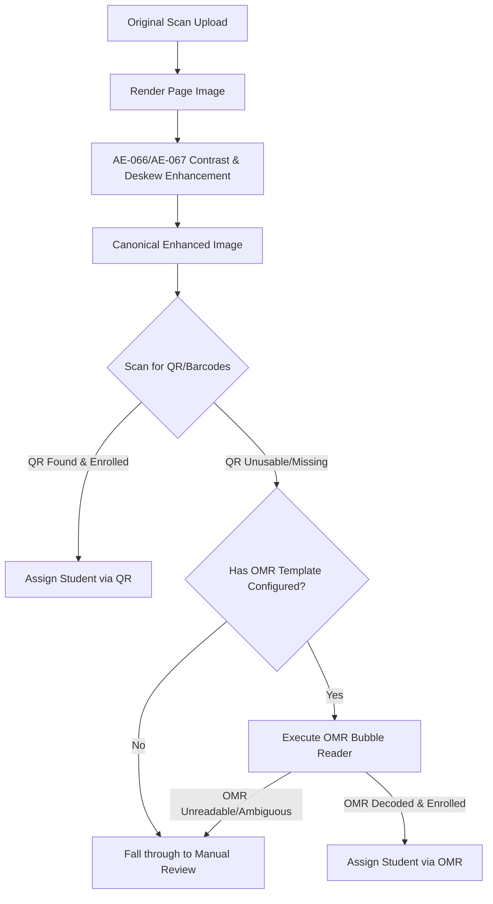

# AE-070: OMR Fallback Bubble Reader for Student ID

This document specifies the design, coordinate conversion system, thresholds, column decoding logic, and integration pipeline of the OMR Bubble Reader fallback.

## Architecture & Integration Pipeline

The OMR reader serves as an automated fallback system when cover page QR / barcode detection fails to identify the student. OMR detection is executed only on page 1 (the cover page) using the exam-level OMR template configuration.



> [!IMPORTANT]
> OMR reads the canonical enhanced, deskewed page image using the normalized exam-level template; it does not read the immutable original upload.

---

## Normalized Coordinate System

To ensure page resolution and DPI independence, the OMR reader translates normalized float coordinates $x, y \in [0.0, 1.0]$ to absolute pixels dynamically:

$$\text{pixelX} = \text{round}(x \times \text{imageWidth})$$
$$\text{pixelY} = \text{round}(y \times \text{imageHeight})$$
$$\text{pixelWidth} = \text{round}(\text{width} \times \text{imageWidth})$$
$$\text{pixelHeight} = \text{round}(\text{height} \times \text{imageHeight})$$

To avoid printed border-only outline interference (e.g. circles / rectangles forming the bubble borders), the scanned region is cropped with a $15\%$ inset from all edges:

```
+-----------------------------------+
|       15% Inset Border Crop       |
|   +---------------------------+   |
|   |                           |   |
|   |    Actual scanned area    |   |
|   |    for ink fill ratio     |   |
|   |                           |   |
|   +---------------------------+   |
+-----------------------------------+
```

---

## Fill Ratio Calculation & Thresholds

For every bubble region, pixel luminance is computed:
$$L = 0.299R + 0.587G + 0.114B$$

A pixel is classified as **dark (ink)** if $L < 180$. The fill ratio is:
$$\text{fillRatio} = \frac{\text{count of dark pixels}}{\text{total pixels in inset scan region}}$$

Bubbles are classified as:
*   **EMPTY**: $\text{fillRatio} < 0.10$ (unmarked bubble)
*   **MARKED**: $\text{fillRatio} \ge 0.25$ (confidently marked bubble)
*   **AMBIGUOUS**: $0.10 \le \text{fillRatio} < 0.25$ (indeterminate state)

---

## Column Decoding & Confidence Margin

A column represents one digit/character of the student ID.
*   **SUCCESS**: Exactly one bubble in the column is classified as `MARKED` and the margin between the strongest and second-strongest bubble is $\ge 0.15$:
    $$\text{confidenceMargin} = \text{strongestFillRatio} - \text{secondStrongestFillRatio} \ge 0.15$$
*   **AMBIGUOUS**: 
    *   Multiple bubbles in the column are `MARKED`.
    *   The strongest bubble's fill ratio is in the ambiguous range ($0.10 \le \text{fillRatio} < 0.25$).
    *   The margin between candidates is $< 0.15$.
*   **UNREADABLE**: Zero bubbles in the column are marked ($\text{fillRatio} < 0.10$ for all bubbles).

---

## Safety Rules (Never Guess)

*   The reader is highly conservative. Any ambiguity (e.g. column empty, multiple marks, low margin, missing template) immediately aborts decoding and returns an unsuccessful outcome to allow manual review.
*   Any candidate decoded OMR student ID is validated against the course roster mapping. If the student is not enrolled or does not exist, the script remains unassigned and triggers a manual review recommendation.
*   Precedence is strictly **Manual/Operator Override > QR > OMR**. Conflict metrics (disagreements between QR and OMR) are recorded under `hasIdentificationConflict` for diagnostic visibility.
