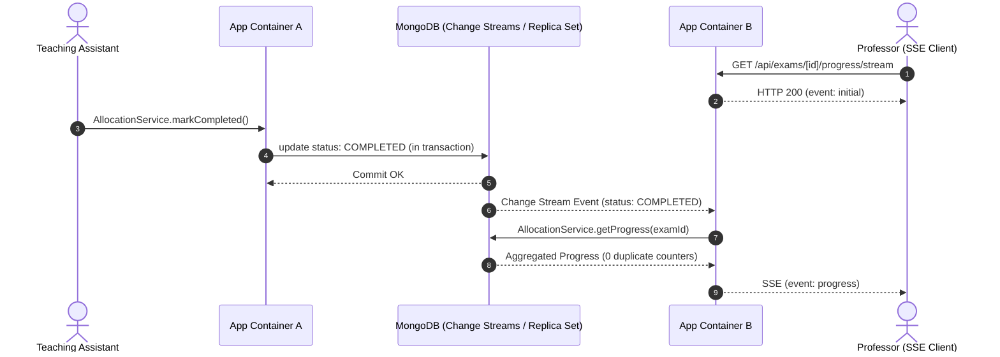

# AE-102 — Backend Live Progress Update Channel

## Objective

Implement a backend live progress update channel that delivers real-time grading progress metrics per Teaching Assistant (TA) to course professors and administrators. The system supports multi-instance container deployments using **MongoDB Change Streams** as a cross-container event bus and **Server-Sent Events (SSE)** as the client subscription transport.

---

## 1. Architecture & Deployment Decision

### 1.1 Deployment Model Assumption

The live progress channel is designed to support multi-instance container
deployments, but the repository does not currently commit a specific
production deployment configuration.

* **Deployment Model**: Multi-instance container deployment is the intended
  production target, pending deployment configuration and confirmation.
* **Cross-Instance Requirement**: If multiple application container instances
  run simultaneously behind a load balancer, progress updates must propagate
  across instances without requiring clients to reconnect to a specific
  instance.
* **Current Repository State**: No Docker, Kubernetes, ECS, or other
  multi-instance deployment configuration is committed by AE-102.

This assumption is relevant to the choice of MongoDB Change Streams as the
cross-instance event backbone and should be confirmed when the production
deployment is established.

### 1.2 Shared Event Backbone: MongoDB Change Streams

To avoid introducing extra third-party message brokers (e.g., Redis or Kafka) and to support the intended multi-instance deployment model, AE-102 leverages **MongoDB Change Streams** on the `allocations` collection:

### 1.2.1 Change Stream Fallback & Degraded State Notification

MongoDB Change Streams are the primary event backbone when the connected
MongoDB deployment supports them.

If Change Streams are unavailable (e.g. standalone Mongo, connection failure,
or stream error), the service falls back to an in-process `EventEmitter` and
explicitly notifies connected SSE clients.

The fallback behavior and semantics:

* Events are delivered only to SSE clients connected to the same application
  instance.
* Clients connected to other application instances do not receive the
  in-process event.
* The service emits an `event: live_updates_unavailable` frame over SSE
  (`{"message":"Live updates unavailable — refresh to see progress."}`) so
  instructors are explicitly aware of the degraded state.
* The SSE connection remains open (not closed) to continue receiving any
  local in-process events.
* The service logs a warning when Change Stream initialization fails or errors.
* Clients can use the existing progress REST endpoint (`GET /api/exams/[id]/progress`)
  as a polling fallback to obtain up-to-date progress.

The fallback is therefore a degraded delivery mode, not an equivalent
replacement for the cross-instance Change Stream architecture.

* **How It Operates Across Multiple Containers When the Multi-Instance Deployment Assumption Applies**:
  1. Container $A$ executes `AllocationService.markCompleted()`, committing an atomic transition from `IN_PROGRESS` to `COMPLETED` in the database.
  2. MongoDB Atlas records this update in its replica set oplog.
  3. All running container instances (Container $A$, $B$, $C$, etc.) watch the change stream and receive the change event.
  4. Each container instance fetches the aggregated progress using the existing AE-098 pipeline (`AllocationService.getProgress(examId)`) and dispatches the update to its locally connected SSE clients subscribed to that `examId`.
* **Resource Optimization**: A single managed Change Stream is opened per application process (lazy-initialized upon first subscription), rather than opening a stream per connected client, protecting MongoDB Atlas connection and cursor capacity.

### 1.3 Selected Transport: Server-Sent Events (SSE)
* **Transport**: **Server-Sent Events (SSE)** via Next.js App Router `ReadableStream` (`GET /api/exams/[id]/progress/stream`).
* **Transport Rationale**:
  * **Unidirectional Fit**: Grading progress streaming is strictly server-to-client; clients only listen to updates.
  * **App Router Native**: Integrates with the Next.js App Router Route Handler using the existing application runtime without requiring a custom Node HTTP server.
  * **Firewall & Proxy Compatibility**: Runs over standard HTTP/1.1 or HTTP/2, traversing enterprise reverse proxies, load balancers, and LMS iframe embeds without WebSocket connection upgrade negotiation issues.
* **Why WebSockets Were Rejected**: WebSockets introduce unnecessary bidirectional complexity, require custom server runtimes or external WebSocket gateways in Next.js, and provide no additional benefit for unidirectional progress streaming.

---

## 2. Event Lifecycle & Trigger



1. **Trigger Condition**: Emitted strictly upon the atomic state transition `AllocationStatus.IN_PROGRESS → COMPLETED` inside `AllocationService.markCompleted()`.
2. **Failed Transition Guard**:
   * Pending allocations, non-existent records, or unauthorized attempts throw errors and generate **no** change stream updates.
3. **Idempotency**:
   * Calling `markCompleted()` on an already `COMPLETED` allocation returns `HTTP 409 Conflict`. No state mutation occurs in MongoDB, preventing duplicate change events.
4. **Single Source of Truth**:
   * Progress counts are computed using the existing MongoDB aggregation pipeline from AE-098 (`AllocationService.getProgress(examId)`). No duplicate progress counters or divergent aggregation logic exist.

---

## 3. Subscription Endpoint Specification

### `GET /api/exams/[id]/progress/stream`

* **Authorization**: Requires `Permission.ALLOCATE_SCRIPTS` (Professors and Admins). Unauthorized callers (`TA`, `STUDENT`) receive `403 Forbidden`.
* **Headers**:
  * `Content-Type: text/event-stream; charset=utf-8`
  * `Cache-Control: no-cache, no-transform`
  * `Connection: keep-alive`
  * `X-Accel-Buffering: no`
* **Lifecycle**:
  1. Upon connection, sends an `event: initial` SSE frame containing the complete initial progress snapshot.
  2. If the server is operating in degraded fallback mode (or transitions into it), sends an `event: live_updates_unavailable` frame.
  3. Subscribes to live progress update events for `examId`.
  4. Pushes `event: progress` SSE frames whenever an allocation for this exam is completed.
  5. When the client disconnects, the request `abort` signal automatically unsubscribes and cleans up local listeners.

---

## 4. Payload Contracts

### 4.1 Initial Event (`event: initial`)
```json
{
  "examId": "60c72b2f9b1d8a001f8e1235",
  "total": 20,
  "graded": 12,
  "progress": [
    {
      "taId": "60c72b2f9b1d8a001f8e1001",
      "name": "Hermione Granger",
      "graded": 8,
      "total": 10
    },
    {
      "taId": "60c72b2f9b1d8a001f8e1002",
      "name": "Ron Weasley",
      "graded": 4,
      "total": 10
    }
  ]
}
```

### 4.2 Live Progress Event (`event: progress`)
```json
{
  "examId": "60c72b2f9b1d8a001f8e1235",
  "taId": "60c72b2f9b1d8a001f8e1001",
  "taProgress": {
    "taId": "60c72b2f9b1d8a001f8e1001",
    "name": "Hermione Granger",
    "graded": 9,
    "total": 10
  },
  "examProgress": {
    "examId": "60c72b2f9b1d8a001f8e1235",
    "total": 20,
    "graded": 13,
    "progress": [
      {
        "taId": "60c72b2f9b1d8a001f8e1001",
        "name": "Hermione Granger",
        "graded": 9,
        "total": 10
      },
      {
        "taId": "60c72b2f9b1d8a001f8e1002",
        "name": "Ron Weasley",
        "graded": 4,
        "total": 10
      }
    ]
  },
  "timestamp": "2026-08-31T17:30:00.000Z"
}
```

### 4.3 Live Updates Unavailable Event (`event: live_updates_unavailable`)
```json
{
  "message": "Live updates unavailable — refresh to see progress."
}
```

---

## 5. Security & Privacy Guarantees

* **Zero Student PII**: Student identification, names, emails, roll numbers, answer script paths, and mapping IDs are strictly excluded from all SSE payloads and event models.
* **Professor-Facing TA Visibility**: TA identities (`taId`, `name`) are intentionally visible to instructors for evaluation progress tracking.
* **Exam Scoping**: Event streams are strictly scoped to the requested `examId`. Subscriptions to `examA` never receive updates for `examB`.

---

## 6. Scope Boundaries & Deferred Features

| Feature | Status | Scope / Details |
| :--- | :--- | :--- |
| **REST Polling Fallback** | **Supported via AE-098** | Clients can poll `GET /api/exams/[id]/progress` on demand if SSE connection drops or is blocked. |
| **AE-103 Polling Feature** | **Not Implemented** | AE-098 serves as the polling baseline; no separate AE-103 feature created. |
| **Frontend Grading Dashboard UI** | **Out of Scope** | Backend streaming channel only; UI integration is handled separately. |
| **Week-7 Grading UI & Save Endpoint** | **Deferred to Week 7** | Future grading save flow will invoke `AllocationService.markCompleted()`. |
