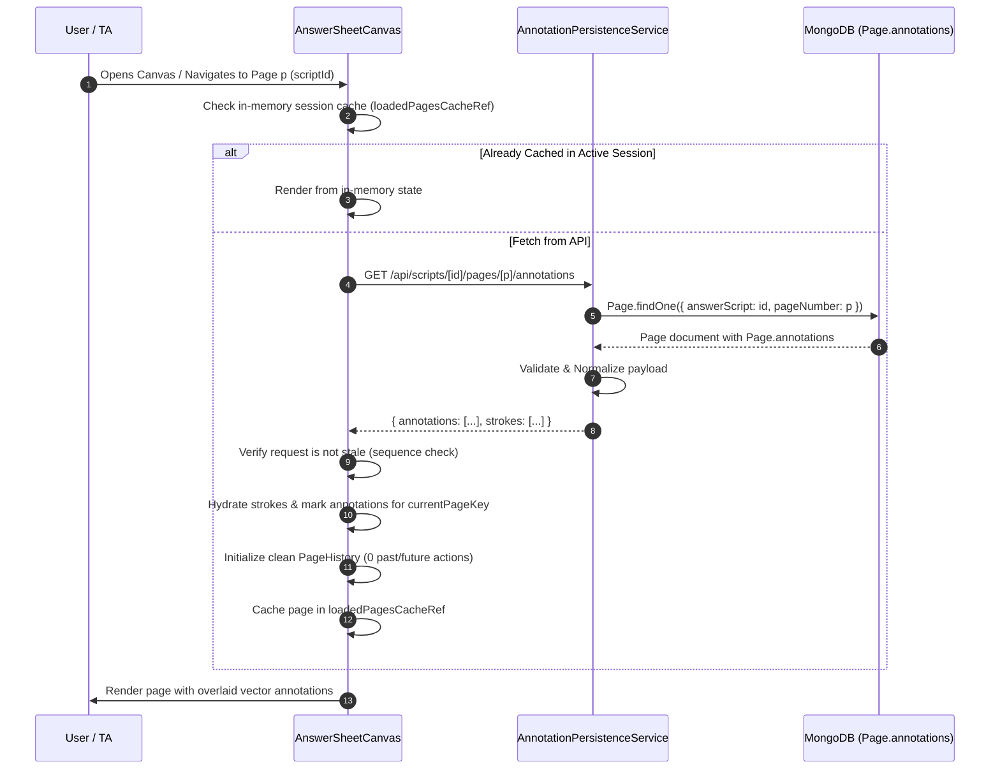

# AE-136: Load Saved Annotations on Canvas Open

## Overview
Ticket **AE-136** implements the client-side and API loading lifecycle for retrieving and hydrating saved vector annotations onto the `AnswerSheetCanvas`.

It reads serialized vector annotations directly from `Page.annotations` (the single source of truth established in **AE-135**), safely validates and deserializes them using **AE-134** utilities, and reconstructs the visual annotation state with complete page isolation, race-condition protection, and clean undo/redo history.

---

## 1. Backend API Specification

### Endpoint
- `GET /api/scripts/[id]/pages/[p]/annotations`

### Route Parameters
- `id`: MongoDB ObjectId of the target `AnswerScript`.
- `p`: Page identifier (either 24-character hexadecimal `ObjectId` of the `Page` or numeric 1-based `pageNumber`).

### Authentication & Permissions
- Evaluator RBAC enforcement: checks `requirePermission(Permission.GRADE_SCRIPT)` with fallback checks for `Permission.SAVE_MARKS_FEEDBACK`, `Permission.EDIT_EXAM`, and `Permission.VIEW_ALL_SUBMISSIONS`.
- Scoped exam access check via `ExamRepository.getExamById(script.exam, userId, userRole)`.
- Rejects unauthenticated requests with `401 Unauthorized`.
- Rejects unauthorized roles (e.g. `STUDENT`) with `403 Forbidden`.

### Script-Page Ownership Verification
- Validates that the requested `Page` strictly belongs to the requested `AnswerScript`. If there is a mismatch, returns `400 Bad Request`.
- If the script or page does not exist, returns `404 Not Found`.

### Success Response (`200 OK`)
```json
{
  "success": true,
  "message": "Annotations loaded successfully",
  "data": {
    "scriptId": "64b8a1c2d3e4f5a6b7c8d9e0",
    "pageId": "64b8a1c2d3e4f5a6b7c8d9e1",
    "pageNumber": 1,
    "annotations": [
      {
        "id": "check_1715000000_1_abc12",
        "pageKey": "page-1",
        "type": "check",
        "x": 120,
        "y": 340,
        "size": 28,
        "color": "#16a34a",
        "createdAt": 1715000000000
      }
    ],
    "strokes": [
      {
        "id": "stroke_1715000004_5_mno90",
        "pageKey": "page-1",
        "points": [50, 60, 55, 65, 60, 70],
        "color": "#e11d48",
        "strokeWidth": 3,
        "createdAt": 1715000004000
      }
    ],
    "totalAnnotations": 1,
    "totalStrokes": 1,
    "annotatedBy": "64b8a1c2d3e4f5a6b7c8d9e2",
    "updatedAt": "2026-09-10T12:00:00.000Z"
  }
}
```

If a page has no annotations saved, the endpoint returns `200 OK` with empty arrays (`annotations: []`, `strokes: []`, `totalAnnotations: 0`, `totalStrokes: 0`).

---

## 2. Canvas Hydration Lifecycle & Data Flow



---

## 3. Hydration Guarantees & Safeguards

### 1. Single Source of Truth
- All annotation data originates exclusively from `Page.annotations`.
- Zero queries, reads, or dual-writes are made to the `Annotation` collection.

### 2. Page Isolation
- Rendering filters strokes and marks strictly by `currentPageKey` (`filterAnnotationsByPage`, `filterStrokesByPage`).
- Switching to another page immediately unmounts previous page annotations from view and loads the active page's vector overlay.
- Selection state (`selectedAnnotationId`) and text note editor are reset on page change.

### 3. Race Condition & Stale Request Protection
- Each fetch uses an `AbortController` and increments a monotonic `activeRequestSeqRef`.
- When the user rapidly navigates through pages (e.g. Page 1 -> Page 2 -> Page 3):
  1. The preceding AbortController is aborted immediately.
  2. Late-arriving responses for prior pages are discarded by checking `activeRequestSeqRef.current === currentSeq`.
  3. Stale responses can never overwrite the active page's annotations.

### 4. In-Memory Session Caching
- Pages hydrated during the active session are tracked in `loadedPagesCacheRef`.
- Navigating back to a previously visited page during the same session utilizes the in-memory state without emitting redundant network requests.

### 5. Clean Undo/Redo History
- When annotations are loaded, the canvas initializes `pageHistoryMap[currentPageKey] = createInitialHistory()`.
- The `past` and `future` stacks start empty (`canUndo = false`, `canRedo = false`), preventing loaded annotations from being mistakenly undone as user actions.

### 6. Read-Only Safety (No Save Triggering)
- Loading and hydration are strictly read-only and emit zero PUT / save requests.

### 7. Coordinate Preservation & Pan/Zoom Decoupling
- Persisted vector coordinates remain strictly in image-base space.
- The canvas transformation pipeline (`PanZoomTransform`) scales and translates the Konva display group without modifying the underlying vector coordinate points.

### 8. Malformed Data Resilience
- If corrupt or malformed data is encountered, `deserializePageAnnotations` catches validation errors and falls back safely to an empty collection (`{ annotations: [], strokes: [] }`) without crashing the canvas.

---

## 4. Test Coverage & Verification

1. **`src/__tests__/LoadAnnotationsApi.test.ts`**:
   - ✓ Successful load by numeric `pageNumber`
   - ✓ Successful load by Page `ObjectId`
   - ✓ Empty page returns 200 with empty collections
   - ✓ Preserves all AE-134 types (check, cross, highlight, text note, pen stroke) and styling
   - ✓ Malformed DB payload fails safely to empty state
   - ✓ 400 Bad Request on invalid script or page ID format
   - ✓ 400 Bad Request on cross-script page mismatch
   - ✓ 404 Not Found on missing script or page
   - ✓ 401 Unauthorized for unauthenticated requests
   - ✓ 403 Forbidden for unauthorized user roles (Student)
   - ✓ Confirms 0 queries / records in `Annotation` collection

2. **`src/__tests__/CanvasAnnotationHydration.test.ts`**:
   - ✓ Deserialization and hydration of all AE-134 types
   - ✓ Multi-page extraction from `SerializedAnnotationDocument`
   - ✓ Safe handling of null / corrupt payloads
   - ✓ Page isolation and cross-page state clearing
   - ✓ Support for pre-loaded `page.annotations`
   - ✓ Clean undo/redo initialization (`canUndo === false`)
   - ✓ Read-only verification (0 save requests triggered)
   - ✓ Race condition and stale response discarding
   - ✓ In-memory session cache avoiding redundant fetches

---

## 5. Out-of-Scope Confirmations
- **AE-137**: Autosave debounce mechanics, dirty-state tracking, and saving indicators are **NOT** part of AE-136 and will be implemented in AE-137.
- **Source Image**: Source image files/paths are immutable and never modified.
