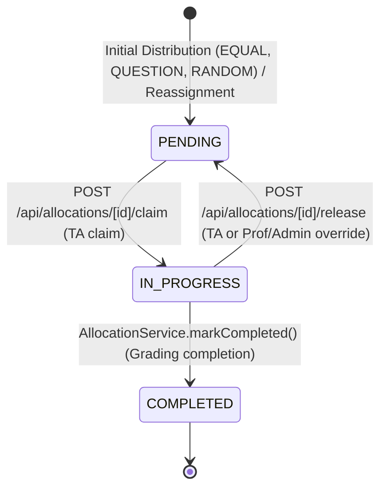

# Allocation Module Runbook

This document serves as the canonical engineering reference, system architecture manual, and operational runbook for the **Allocation Module** of the Assignment Evaluation platform.

---

## 1. Purpose and Scope

The Allocation Module is responsible for distributing approved student answer scripts among teaching assistants (TAs) for grading, managing the grading work-queue lifecycle, handling allocation claims and releases, executing state completion transitions, and providing aggregated grading progress metrics to course instructors.

The module boundaries are defined as:
- **Allocation Entry**: Begins after an exam's ingestion state has been approved and sealed (`IngestionApprovalStatus.APPROVED`). Attempts to preview, configure, or execute allocations on unapproved exams are blocked at the ingestion gate.
- **Allocation Exit**: Serves as the substrate for TA grading work queues (`GET /api/allocations`) and tracks completion transitions (`COMPLETED`). In future milestones (Week 7), the final grading submission save flow will call `AllocationService.markCompleted()` to complete each allocation. The grading save caller does not exist currently in this milestone.

---

## 2. Allocation Lifecycle and State Machine

Grading allocations strictly adhere to the `AllocationStatus` lifecycle defined in [`src/models/Allocation.ts`](file:///c:/Users/AARATHISREE/Desktop/IIIT%20Hyd%20-%20Assignment%20Evaluation/Project%20Repo/assignment-evaluator/src/models/Allocation.ts).



### 2.1 State Definitions
* **`PENDING`**: The script (or question) is assigned to a TA but grading has not yet commenced. The allocation is available in the TA's queue for claiming.
* **`IN_PROGRESS`**: The assigned TA has claimed the allocation and is currently evaluating it. Claim locks the allocation against concurrent claims.
* **`COMPLETED`**: Grading evaluation is finished. `COMPLETED` allocations cannot be released back to `PENDING` or claimed again (idempotent terminal status).

### 2.2 Transitions
1. **`PENDING` → `IN_PROGRESS` (Claim)**:
   * Performed via `POST /api/allocations/[id]/claim` (`AllocationService.claimAllocation`).
   * Atomically transitions the allocation if and only if `status == PENDING` and `ta == auth.user.id`.
   * Concurrent claims result in exactly one successful claim (HTTP 200) and a conflict response (HTTP 409) for subsequent callers.
   * Emits an `ALLOCATION_CLAIM` audit log.
2. **`IN_PROGRESS` → `PENDING` (Release)**:
   * Performed via `POST /api/allocations/[id]/release` (`AllocationService.releaseAllocation`).
   * Atomically resets status back to `PENDING` if `status == IN_PROGRESS`.
   * Can be executed by the assigned TA or by backup operators (`PROFESSOR` / `ADMIN`).
   * Emits an `ALLOCATION_RELEASE` audit log (flagging `isOverride: true` if released by a non-owner backup operator).
3. **`IN_PROGRESS` → `COMPLETED` (Mark Completed)**:
   * Performed via `AllocationService.markCompleted(allocationId, actor)`.
   * Designed to be invoked by the future Week-7 grading save flow upon final grade submission.
   * Atomically transitions `IN_PROGRESS` → `COMPLETED` matching `_id` and authorized actor.
   * Emits an `ALLOCATION_COMPLETE` audit log inside a transaction.

### 2.3 Completion Idempotency Contract
* **First Successful Call (`IN_PROGRESS` → `COMPLETED`)**: Atomically updates the allocation status to `COMPLETED`, records an `ALLOCATION_COMPLETE` audit entry, and returns the updated allocation document.
* **Repeated Call on Already `COMPLETED` Allocation**: Returns `HTTP 409 Conflict` with message `"Allocation is already completed"`. No duplicate audit log is generated.
* **Week-7 Grade-Save Contract**: The `HTTP 409 Conflict` response is intentional and indicates the allocation is already completed. The future Week-7 grade-save caller must treat an already-completed allocation (`HTTP 409`) as an **idempotent outcome** rather than assuming the completion state was lost or failing the grading workflow.
* **Pending Rejection**: Attempting to complete a `PENDING` allocation returns `HTTP 400 Bad Request` (`"Cannot complete a pending allocation"`).
* **Authorization**: The primary owner (assigned TA) can only complete their own allocations. Backup operators (`UserRole.PROFESSOR`, `UserRole.ADMIN`) can complete any allocation on behalf of the assigned TA (logged with `isOverride: true`). An unassigned TA attempting to complete another TA's allocation receives `HTTP 403 Forbidden`.

---

## 3. Allocation Generation and Preview

The allocation engine ([`src/services/AllocationService.ts`](file:///c:/Users/AARATHISREE/Desktop/IIIT%20Hyd%20-%20Assignment%20Evaluation/Project%20Repo/assignment-evaluator/src/services/AllocationService.ts)) distributes active, approved answer scripts across course TAs using three allocation strategies:

### 3.1 Allocation Rules (`AllocationRule`)
1. **`EQUAL` (Whole-Script Equal Distribution)**:
   * Distributes whole answer scripts evenly across the selected TAs using round-robin distribution.
   * Remainder scripts are distributed deterministically across the first $R$ TAs.
2. **`QUESTION` (Question-Wise Partitioning)**:
   * Partitions scripts by individual question numbers ($1 \dots N$, where $N = \text{exam.numberOfQuestions}$).
   * For each question $q$, all scripts for that question are assigned round-robin to the selected TAs.
   * Creates $N$ allocation documents per answer script.
3. **`RANDOM` (Seeded Pseudo-Random Distribution)**:
   * Shuffles eligible scripts using a deterministic Mulberry32 PRNG initialized with an integer `seed`.
   * Distributes the shuffled scripts evenly across selected TAs.
   * Guarantees reproducible distributions given identical inputs and seed.

### 3.2 Side-Effect-Free Preview (`POST /api/exams/[id]/allocate/preview`)
* Allows instructors to inspect the distribution outcome before committing changes to the database.
* Returns per-TA allocation counts, total eligible scripts, total excluded scripts, and exclusion breakdown by reason.
* Executes in memory without persisting any database records.

### 3.3 Re-Run Protection & Script Exclusion
* **Re-run Gate**: If an exam already has allocations where any allocation is `IN_PROGRESS` or `COMPLETED`, re-running allocation is rejected with `400 Bad Request` to protect grading in progress.
* **Exclusion Criteria**: Scripts lacking student identification (marked `needsManualId: true`), blank scripts (`isNearBlank: true`), duplicate scripts (`isDuplicate: true`), or inactive scripts are excluded from allocation.

### 3.4 Mixed-Mode Allocation Prevention
Schema-level pre-save hooks in [`src/models/Allocation.ts`](file:///c:/Users/AARATHISREE/Desktop/IIIT%20Hyd%20-%20Assignment%20Evaluation/Project%20Repo/assignment-evaluator/src/models/Allocation.ts) strictly prevent mixed-mode grading: an answer script cannot simultaneously possess whole-script and question-wise allocations.

---

## 4. Manual Reassignment (`PUT /api/exams/[id]/allocate/reassign`)

Instructors can reassign an allocation from one TA to another eligible course TA:
* **Preconditions**:
  * The target TA must be enrolled as an active TA on the parent course.
  * The allocation status must be `PENDING` (cannot reassign `IN_PROGRESS` or `COMPLETED` allocations).
* **Execution**: Atomically updates the `ta` reference on the allocation and writes an `ALLOCATION_REASSIGN` audit record with previous and new TA identities.

---

## 5. TA Work Queue API (`GET /api/allocations`)

The TA grading work queue ([`src/app/api/allocations/route.ts`](file:///c:/Users/AARATHISREE/Desktop/IIIT%20Hyd%20-%20Assignment%20Evaluation/Project%20Repo/assignment-evaluator/src/app/api/allocations/route.ts)) powers the grading dashboard for TAs:
* **Ownership Isolation**: Queries are strictly scoped to `ta: auth.user.id`. TAs cannot view or access allocations assigned to other TAs.
* **Sorting**: Default ordering is oldest-first (`createdAt` ascending, followed by `_id` ascending). Explicit sorting parameters (`sort=oldest`, `sort=oldest-first`, `sort=createdAt`) are supported. Unsupported sort orders (such as difficulty sorting) are rejected with `400 Bad Request`.
* **Pagination**: Supports `page` and `limit` parameters (default `page=1`, `limit=20`, max `limit=100`).
* **Filtering**: Supports optional filtering by `examId` and `status`.
* **Anonymization (Blind Grading)**:
  * Integrates with `Anonymizer.serializeAnswerScripts(scripts, viewer)` ([`src/lib/anonymizer.ts`](file:///c:/Users/AARATHISREE/Desktop/IIIT%20Hyd%20-%20Assignment%20Evaluation/Project%20Repo/assignment-evaluator/src/lib/anonymizer.ts)).
  * Under blind-grading enabled exams, student PII (`student`, `qrStudentId`, `omrStudentId`, `candidateStudentId`) is stripped from the returned `answerScript` payload and replaced with `anonymousId` / `scriptReference`.

---

## 6. Progress Aggregation (`GET /api/exams/[id]/progress`)

The progress aggregation endpoint ([`src/app/api/exams/[id]/progress/route.ts`](file:///c:/Users/AARATHISREE/Desktop/IIIT%20Hyd%20-%20Assignment%20Evaluation/Project%20Repo/assignment-evaluator/src/app/api/exams/%5Bid%5D/progress/route.ts)) provides professor-facing grading progress per TA:
* **Server-Side Aggregation**: Utilizes a single MongoDB aggregation pipeline (`$match`, `$group`, `$sum`, `$lookup`, `$unwind`, `$project`, `$sort`) in [`src/services/AllocationService.ts`](file:///c:/Users/AARATHISREE/Desktop/IIIT%20Hyd%20-%20Assignment%20Evaluation/Project%20Repo/assignment-evaluator/src/services/AllocationService.ts). Entire document collections are never loaded into application memory.
* **Metrics Returned (per TA)**:
  * `taId`: TA user ID string.
  * `name`: TA name (defaults to `'Unknown TA'` if user record is unresolvable).
  * `total`: Total allocations assigned to that TA for the exam.
  * `graded`: Count of allocations whose status is `AllocationStatus.COMPLETED`.
* **Exam Scoping**: Aggregation strictly matches `exam: ObjectId(examId)`.
* **Unified Allocation Support**: Uniformly handles both whole-script and question-wise allocations without special-case counters.
* **No Email Exposure**: TA email address is explicitly excluded from the progress aggregation pipeline and response payload.
* **Professor-Facing TA Visibility**: TA names and IDs are intentionally visible to instructors to track grading responsibilities.
* **Zero Student PII**: Student identification, roll numbers, script filenames, and mapping references are completely excluded from the aggregation and response payload.

### 6.1 Progress Response Example (200 OK)
```json
{
  "success": true,
  "message": "Progress retrieved successfully",
  "data": {
    "examId": "60c72b2f9b1d8a001f8e1235",
    "total": 20,
    "graded": 12,
    "progress": [
      {
        "taId": "60c72b2f9b1d8a001f8e1001",
        "name": "Hermione Granger",
        "graded": 8,
        "total": 10
      },
      {
        "taId": "60c72b2f9b1d8a001f8e1002",
        "name": "Ron Weasley",
        "graded": 4,
        "total": 10
      }
    ]
  }
}
```

---

## 7. Authorization Matrix

| Action | HTTP Route / Entry Point | Required Permission / Check | Allowed Roles |
| :--- | :--- | :--- | :--- |
| **Allocate Scripts** | `POST /api/exams/[id]/allocate` | `Permission.ALLOCATE_SCRIPTS` | `PROFESSOR`, `ADMIN` |
| **Preview Allocation** | `POST /api/exams/[id]/allocate/preview` | `Permission.ALLOCATE_SCRIPTS` | `PROFESSOR`, `ADMIN` |
| **Reassign Allocation** | `PUT /api/exams/[id]/allocate/reassign` | `Permission.ALLOCATE_SCRIPTS` | `PROFESSOR`, `ADMIN` |
| **View TA Work Queue** | `GET /api/allocations` | `Permission.VIEW_ASSIGNED_SCRIPTS` | `TA`, `ADMIN` |
| **Claim Allocation** | `POST /api/allocations/[id]/claim` | `Permission.GRADE_SCRIPT` | Assigned `TA`, `ADMIN` |
| **Release Allocation (Own)** | `POST /api/allocations/[id]/release` | `Permission.GRADE_SCRIPT` | Assigned `TA`, `ADMIN` |
| **Release Allocation (Override)**| `POST /api/allocations/[id]/release` | `Permission.ALLOCATE_SCRIPTS` | `PROFESSOR`, `ADMIN` |
| **Mark Completed** | `AllocationService.markCompleted()` | Role & Actor ownership check (`UserRole`) | Assigned `TA`, `PROFESSOR`, `ADMIN` |
| **View Exam Progress** | `GET /api/exams/[id]/progress` | `Permission.ALLOCATE_SCRIPTS` | `PROFESSOR`, `ADMIN` |

---

## 8. Source File and API Route Index

### 8.1 Models
* [`src/models/Allocation.ts`](file:///c:/Users/AARATHISREE/Desktop/IIIT%20Hyd%20-%20Assignment%20Evaluation/Project%20Repo/assignment-evaluator/src/models/Allocation.ts): Schema, `AllocationStatus`, `AllocationRule`, compound indexes, and mixed-mode validation hooks.
* [`src/models/AuditLog.ts`](file:///c:/Users/AARATHISREE/Desktop/IIIT%20Hyd%20-%20Assignment%20Evaluation/Project%20Repo/assignment-evaluator/src/models/AuditLog.ts): Audit log schema for allocation operations (`ALLOCATION_CLAIM`, `ALLOCATION_RELEASE`, `ALLOCATION_REASSIGN`, `ALLOCATION_COMPLETE`).

### 8.2 Services & Helpers
* [`src/services/AllocationService.ts`](file:///c:/Users/AARATHISREE/Desktop/IIIT%20Hyd%20-%20Assignment%20Evaluation/Project%20Repo/assignment-evaluator/src/services/AllocationService.ts): Core allocation engine, preview, reassignment, claim, release, mark completed, and progress aggregation pipeline.
* [`src/lib/anonymizer.ts`](file:///c:/Users/AARATHISREE/Desktop/IIIT%20Hyd%20-%20Assignment%20Evaluation/Project%20Repo/assignment-evaluator/src/lib/anonymizer.ts): Blind grading serializer for TA work queue responses.
* [`src/constants/permissions.ts`](file:///c:/Users/AARATHISREE/Desktop/IIIT%20Hyd%20-%20Assignment%20Evaluation/Project%20Repo/assignment-evaluator/src/constants/permissions.ts): Role-permission definitions (`ALLOCATE_SCRIPTS`, `VIEW_ASSIGNED_SCRIPTS`, `GRADE_SCRIPT`).

### 8.3 API Routes
* [`src/app/api/exams/[id]/allocate/route.ts`](file:///c:/Users/AARATHISREE/Desktop/IIIT%20Hyd%20-%20Assignment%20Evaluation/Project%20Repo/assignment-evaluator/src/app/api/exams/%5Bid%5D/allocate/route.ts): `POST` (create allocations) and `GET` (fetch allocation configuration settings).
* [`src/app/api/exams/[id]/allocate/preview/route.ts`](file:///c:/Users/AARATHISREE/Desktop/IIIT%20Hyd%20-%20Assignment%20Evaluation/Project%20Repo/assignment-evaluator/src/app/api/exams/%5Bid%5D/allocate/preview/route.ts): `POST` (preview allocation counts).
* [`src/app/api/exams/[id]/allocate/reassign/route.ts`](file:///c:/Users/AARATHISREE/Desktop/IIIT%20Hyd%20-%20Assignment%20Evaluation/Project%20Repo/assignment-evaluator/src/app/api/exams/%5Bid%5D/allocate/reassign/route.ts): `PUT` (reassign pending allocation to another TA).
* [`src/app/api/allocations/route.ts`](file:///c:/Users/AARATHISREE/Desktop/IIIT%20Hyd%20-%20Assignment%20Evaluation/Project%20Repo/assignment-evaluator/src/app/api/allocations/route.ts): `GET` (TA work queue with pagination, sorting, and anonymization).
* [`src/app/api/allocations/[id]/claim/route.ts`](file:///c:/Users/AARATHISREE/Desktop/IIIT%20Hyd%20-%20Assignment%20Evaluation/Project%20Repo/assignment-evaluator/src/app/api/allocations/%5Bid%5D/claim/route.ts): `POST` (claim pending allocation).
* [`src/app/api/allocations/[id]/release/route.ts`](file:///c:/Users/AARATHISREE/Desktop/IIIT%20Hyd%20-%20Assignment%20Evaluation/Project%20Repo/assignment-evaluator/src/app/api/allocations/%5Bid%5D/release/route.ts): `POST` (release in-progress allocation).
* [`src/app/api/exams/[id]/progress/route.ts`](file:///c:/Users/AARATHISREE/Desktop/IIIT%20Hyd%20-%20Assignment%20Evaluation/Project%20Repo/assignment-evaluator/src/app/api/exams/%5Bid%5D/progress/route.ts): `GET` (aggregated grading progress per TA for an exam).

---

## 9. Deferred Functionality

> [!NOTE]
> * **Live Progress Updates (Deferred to Week 6)**: Real-time progress updates via WebSocket or Server-Sent Events (SSE) are deferred to Week 6. Progress data is currently polled on demand via `GET /api/exams/[id]/progress`.
> * **Grading UI & Grade-Save Integration (Deferred to Week 7)**: The grading interface UI, marks calculation, and grade-save endpoint are scheduled for Week 7. The future Week-7 grading save flow will invoke `AllocationService.markCompleted()` upon final grade submission. The grading save caller is not implemented in this milestone.
> * **Difficulty-Based Work Queue Sorting (Deferred to AE-097b)**: Sorting allocations by question or script complexity/difficulty is deferred to AE-097b. The backend explicitly rejects difficulty sort parameters with HTTP 400 Bad Request.
