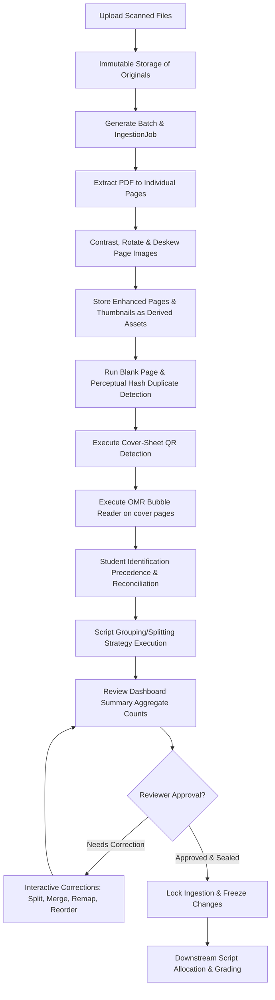

# Ingestion Module Runbook

This document serves as the canonical engineering handover, system architecture manual, and operational runbook for the **Ingestion Module** of the Assignment Evaluation platform.

---

## 1. Purpose and Scope

The Ingestion Module is responsible for receiving raw, multi-page scanned PDF or image documents, validating their cryptographic integrity, extracting individual pages, performing image enhancements (deskewing/auto-rotation), running OCR/OMR/QR student identification, and assembling these pages into logical student answer scripts. 

The boundaries of the ingestion module are defined as:
- **Ingestion Entry**: Begins when an instructor uploads a batch of files for a specific exam.
- **Ingestion Exit**: Ends once a reviewer (Professor or Admin) approves the ingestion assembly state, generating a cryptographic assembly seal. Downstream grading workflows, such as script allocation and grading, are blocked until this approval gate is passed.

---

## 2. High-Level End-to-End Flow

Below is the end-to-end processing pipeline for a batch:



---

## 3. Core Data Model

The database schemas (located in `src/models/`) represent the following ingestion entities:

### 3.1 `Batch` (`src/models/Batch.ts`)
Represents the physical collection of uploaded files.
- Links to an `Exam`.
- Contains a list of files, each with an original filename, file index, file size, page count, and an `originalSeal` (HMAC sha256) verifying the immutability of the uploaded bytes.

### 3.2 `IngestionJob` (`src/models/IngestionJob.ts`)
Tracks the asynchronous background execution processing a batch.
- Status transitions: `pending` → `processing` → `completed` or `failed`.

### 3.3 `IngestionPage` (`src/models/IngestionPage.ts`)
Represents a single extracted physical page from the uploaded documents.
- Stores references to its parent `batchId`, `job` ID, `fileId`, `fileIndex`, and `pageNumber`.
- Stores the `storageKey` of the enhanced image, `thumbnailKey` of the preview image, dimensions, and processing status.
- Keeps classification flags: `nearBlank` (boolean), `isDuplicate` (boolean), `duplicateOf` (reference to another `IngestionPage`).
- Keeps extraction payloads: `qrStudentId`, `qrDecodeOutcome`, `omrStudentId`, `omrDecodeOutcome`, and `enhancementParams` (deskew angle, orientation rotation).

### 3.4 `AnswerScript` (`src/models/AnswerScript.ts`)
Represents the logical boundaries of a student's submission (e.g. pages 1 to 5).
- Links to `Exam` and `student` (User ID).
- Defines page range (`startPageNumber`, `endPageNumber`, `pageCount`).
- Contains review flags: `needsManualId` (boolean), `manualIdReason` (enum), `hasIdentificationConflict` (boolean), and `identificationSource` (`QR` | `OMR` | `OPERATOR` | `OCR` | `null`).

### 3.5 `Exam` (`src/models/Exam.ts`)
Tracks course-exam configurations and the persisted ingestion approval state.
- Stores OMR templates, splitting strategies, and the cryptographic assembly seal metadata.

### 3.6 `AuditLog` (`src/models/AuditLog.ts`)
Records all audit events (e.g. `INGESTION_APPROVED`, `INGESTION_APPROVAL_REVOKED`, `INGESTION_ASSEMBLY_VERIFIED`) with user details, outcome, and client IP addresses.

---

## 4. Original vs. Derived Assets

A clear cryptographic and operational distinction exists between original scan data and pipeline-generated previews:

| Attribute | Original Source Content | Derived Preview Assets |
| :--- | :--- | :--- |
| **Protected Entity** | Raw uploaded file bytes (`PDF` or images) | Deskewed, contrast-adjusted page images and thumbnails |
| **Immutability** | **Immutable**. Stored once and sealed with `originalSeal` at upload. | **Mutable/Regenerable**. Can be updated by tweaking parameters. |
| **Storage Location** | `ORIGINAL_STORAGE_PATH` (disk/cloud) | `DerivedStorageService` (derived/thumbnail keys) |
| **Sealing Level** | HMAC computed over raw file content + upload metadata. | Not sealed. The final **Assembly Seal** covers only the logical arrangements. |

---

## 5. Enhancement and Determinism

To ensure reliability, the page enhancement pipeline adheres to strict determinism rules (introduced in **AE-069**):
- **Deterministic Processing**: Re-running the enhancement pipeline on the same raw image with the same parameters produces byte-identical results.
- **Originals Untouched**: Contrast adjustment, rotation, and deskewing create new derived image buffers. The original uploaded bytes are never overwritten or modified.
- **Safety Fallback**: If page rendering or enhancement fails, the pipeline logs the failure, marks the page record `FAILED`, and continues processing the rest of the batch.

---

## 6. Page Classification and Script Assembly

### 6.1 Script Grouping & Splitting
`StudentRosterMappingService` divides pages into logical scripts using the exam's splitting strategy:
- `COVER_PAGE`: A cover page containing QR/OMR starts a new script.
- `FIXED_PAGE`: Scripts are sliced into fixed intervals (e.g. every 5 pages).

### 6.2 Blank Page & Duplicate Handling
- **Blank Pages**: Calculated via luminance thresholding. If the non-white pixel ratio is below `0.5%` (excluding border margins), the page is marked `nearBlank: true`.
- **Duplicates**: Calculated using dHash perceptual hashing. If the Hamming distance between a page and another page in the batch is $\le 10$, the page is marked `isDuplicate: true` with a pointer to the original page in `duplicateOf`.

### 6.3 Post-Ingestion Corrections
Reviewers can manually adjust the composition of scripts:
- **Remap**: Move a page from one script to another.
- **Merge**: Combine two separate scripts.
- **Split**: Break a script into two separate scripts.
- **Reorder**: Change the page sequence within a script.

---

## 7. Student Identification & Precedence

Student identification follows a strict precedence model implemented in `StudentRosterMappingService`:

1. **Manual / Operator Override (Highest Precedence)**: Manual identification immediately halts automated checks. Automatic runs will never overwrite a student bound by an operator.
2. **QR Code Extraction (Second Precedence)**: Decodes cover-page QR tags containing `examId:studentId`.
3. **OMR Bubble Scanning (Third Precedence)**: Decodes bubble-filled coordinates mapped to Student IDs.

### Conflicting Signals
OMR is executed on **every** cover sheet (not just as a QR fallback) to detect discrepancies. If both QR and OMR produce student IDs but they do not match, `hasIdentificationConflict` is flagged `true` on the `AnswerScript` record, alerting reviewers to check the document.

---

## 8. OMR Templates and Detection

### Coordinate Normalization
To prevent DPI/resolution misalignment, OMR templates use normalized floats ($x, y, \text{width}, \text{height} \in [0.0, 1.0]$). These are validated at the schema level in `Exam.ts`.

### Processing Order
Template matching relies on the following execution sequence:
1. **Contrast & Deskew Enhancement**: Auto-rotates and aligns the page.
2. **Cover-Sheet Detection**: Establishes cover page status.
3. **OMR Reading**: Reads coordinates directly from the **enhanced image buffer**.
This ordering is mandatory because OMR grids will misalign if read from skewed or rotated source pages.

---

## 9. Review Dashboard

The review dashboard aggregates exam ingestion metrics:
- **Faceted Aggregation**: Performed on the server-side in a single pass using MongoDB `$facet` aggregation to compute:
  - `totalScripts`: active scripts.
  - `unmatched`: scripts lacking identified students or flagged for manual review.
  - `blank`: scripts where **all** pages are marked `nearBlank: true`.
  - `duplicate`: duplicate script detections.
  - `conflict`: identification conflicts.
- **Drill-down Panels**: Selecting a count tile filters the matching script records, showing page previews and inline rosters for quick manual identification.

---

## 10. Ingestion Approval Workflow

Approval functions as a concrete gate:
- **Transitions**: `PENDING_REVIEW` → `APPROVED`
- **Fields Updated**: `ingestionApprovalStatus` becomes `APPROVED`, recording `approvedBy` and `approvedAt`.
- **Reset on Upload**: If a new batch is successfully processed for an exam, the status resets to `PENDING_REVIEW`, clearing all approval and seal metadata. This ensures new files must be re-reviewed.

---

## 11. Assembly Seal and Verification

On approval, a cryptographic signature is generated for the logical structure:
1. **Canonicalization**: Scripts are sorted lexicographically by `_id`. Within each script, pages are sorted numerically by `pageNumber`.
2. **Payload**: Serializes script IDs, assigned student IDs, page IDs, original source details (`batchId`, `fileId`, `pageNumber`), and classification flags.
3. **HMAC Generation**: Computes `generateHmacSeal` on the serialization.
4. **Verification**: Executing `verifyAssembly` recalculates the canonical string and verifies it against the persisted `assemblySeal`. It returns `INTACT` (success), `MISMATCH` (tampering detected), `UNAPPROVED`, `UNSEALED`, or `ERROR` (HMAC key rotated/unavailable).

---

## 12. Correction Freeze

To preserve grading stability:
- **APPROVED status blocks composition-changing operations**: Attempts to call remap, merge, split, or reorder endpoints return an HTTP `409 Conflict` error.
- **Modification Cycle**:
  1. Revoke Ingestion Approval (resets to `PENDING_REVIEW`).
  2. Perform corrections.
  3. Re-evaluate counts on the Review Dashboard.
  4. Approve Ingestion (generates a new `assemblySeal`).

---

## 13. Allocation / Grading Gate

Downstream allocation and grading routines block unapproved exams:
- `POST /api/exams/[id]/allocate` calls `IngestionApprovalService.requireApproved(examId)`.
- If the status is not `APPROVED`, it aborts and returns HTTP `403 Forbidden` with a message.

---

## 14. Operational Runbook

### 14.1 Upload and Process a Batch
1. Navigate to the Exam page and click **Upload Batch**.
2. Select your PDF files and upload.
3. The server validates files, stores them, and launches an asynchronous background job (`IngestionJob`).
4. Monitor the processing status on the Ingestion Panel.

### 14.2 Review an Exam
1. Open the exam card and click the **Review** button to navigate to the Review Dashboard.
2. Check the category counts (Unmatched, Blank, Duplicate, Conflict).
3. If unmatched scripts are present, select the card and use the inline **Identify** dropdown to link them to the student roster.

### 14.3 Correct Script Composition
1. If pages are grouped incorrectly, click the **Edit Script** button.
2. If the exam was approved, click **Revoke Ingestion** first.
3. Perform split, merge, remap, or reorder operations.
4. Navigate back to the dashboard, verify the counts, and click **Approve & Seal Ingestion**.

---

## 15. Troubleshooting Runbook

### 15.1 A Job is Stuck in Processing
- **Symptoms**: Ingestion status remains `processing` for an extended period.
- **Checks**:
  1. Check the `IngestionJob` record in MongoDB. If the status is stuck, inspect the logs of `IngestionWorker`.
  2. Check if the server crashed. Ingestion jobs do not self-recover. Instructors can re-upload the batch which resets the job.
  3. Verify the files are valid, uncorrupted PDFs.

### 15.2 OMR Results Misaligned or Incorrect
- **Symptoms**: Bubble reader decodes wrong student IDs.
- **Checks**:
  1. Verify the OMR template coordinates on the Exam page. Check if coordinates are normalized correctly between `0.0` and `1.0`.
  2. Check the orientation of the scan. If deskewing failed to correct a heavily rotated scan (e.g. >45 degrees), OMR bubbles will misalign.
  3. Inspect the page preview to confirm contrast enhancement was applied before OMR execution.

### 15.3 Every Script Flags `needs_manual_id`
- **Symptoms**: Zero scripts identified automatically.
- **Checks**:
  1. Inspect the cover page. Confirm the QR code is present and readable.
  2. Check the student roster mapping. If student mappings are not configured for the exam/course, QR/OMR IDs will fail roster validation and fallback to manual review.

### 15.4 Assembly Verification Reports a `MISMATCH`
- **Symptoms**: Integrity check fails.
- **Checks**:
  1. This indicates out-of-band database changes. Run the verification audit logs.
  2. Check if a database administrator manually reassigned a script's student ID or reordered page references after the seal was created.
  3. To fix, revoke the approval and re-approve to generate a new valid seal.

---

## 16. Important Design Decisions

| Decision | Why |
| :--- | :--- |
| **Originals Sealed at Upload** | Raw scans are immutable source data and must be protected from tampering. |
| **Derived Assets Mutable** | Previews and rotated/deskewed images can be regenerated without altering the raw submissions. |
| **Manual ID Overrides Automated** | Human review decisions are authoritative and must not be overwritten by automatic scans. |
| **OMR Runs on All Cover Sheets** | Running OMR alongside QR allows the system to detect and flag identification conflicts. |
| **Faceted Aggregation** | Computes review metrics in a single MongoDB query, optimizing performance. |
| **Composition Block** | Freezes composition mutations while an exam is approved to guarantee stable grading bounds. |

---

## 17. Testing and Verification

To verify the ingestion pipeline, run the following commands:

```bash
# Run all unit and integration tests
npm test

# Run TypeScript type validation
npx tsc --noEmit

# Run code style linter
npm run lint

# Check for trailing whitespaces
git diff --check
```
