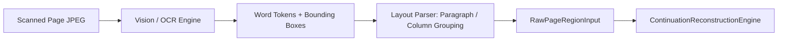

# Research Direction 3: Question–Answer Segmentation & Reconstruction

**Author / Lead:** Antigravity AI (Pair Programming with IIIT Hyderabad Research Team)  
**Supervisor / Requirement Lead:** Prof. C. V. Jawahar  
**Branch:** `research/jawahar-3-answer-segmentation`  
**Status:** Phase 2 Prototype Complete  

---

> [!IMPORTANT]
> **Prototype & Research Isolation Notice:**  
> - This implementation is strictly an **isolated research prototype** built to demonstrate multi-signal Question–Answer association and distal reconstruction.
> - The **current production ingestion, splitting, and sealing pipelines (`IngestionWorker`, `PageIngestionService`, `CoverBoundarySplittingStrategy`) remain 100% unchanged**.
> - The existing TA grading workflow and evaluation APIs remain unimpacted.
> - The current repository **does not yet provide an end-to-end handwritten OCR or dense layout segmentation pipeline**; tests and prototypes operate with digital PDF text, bounding box annotations, and deterministic synthetic fixtures.
> - All confidence thresholds (`AUTO_RECONSTRUCTED >= 0.85`, `NEEDS_REVIEW: 0.50 - 0.84`) are **heuristic evidence scores**, not statistically calibrated probabilities, and require empirical calibration on real handwritten answer-sheet datasets.

---

## 1. Research Objective

In handwritten University examinations (such as midterms and finals at IIIT Hyderabad), students frequently answer questions non-linearly:
1. An answer may begin on Page 1 and continue on Page 7 ($Q_1 \text{ Page 1} \to \text{Page 7}$) because the student ran out of initial allotted booklet space.
2. Students answer questions out of numerical order ($Q_3 \to Q_1 \to Q_5 \to Q_2$).
3. Multiple distinct questions share the same physical page (e.g. bottom half of Page 2 is $Q_1$, top half is $Q_2$).
4. Students use varied, handwritten continuation markers (`"Q1 contd"`, `"cont. on p. 7"`, `"PTO"`, or omit headers entirely).
5. Segments may be ambiguous or unlabelled.

The objective of **Research Direction 3** is to build an isolated **Question–Answer Reconstruction layer** that ingests raw page regions and reconstructs unified, ordered question-answer sequences ($Q_i \to [\text{Segment}_1, \text{Segment}_2, \dots]$) with bounding boxes and evidence trails *before* answers are presented to Teaching Assistants (TAs) or automated grading rubrics.

---

## 2. Existing Ingestion Architecture

The current production backend processes answer scripts as linear sequences of pages:
- **PDF Upload:** Multi-page PDF or ZIP of scans is uploaded to `/api/ingestion/upload`.
- **Page Extraction:** `PageIngestionService` converts PDF pages to high-resolution JPEG images (`Page` documents, `IngestionPage` tracking documents) and computes SHA-256 hashes and perceptual image quality metrics (blur, contrast, brightness).
- **Batch Processing:** `IngestionWorker` drives state transitions (`UPLOADED` $\to$ `VALIDATED` $\to$ `SPLITTING` $\to$ `INGESTED`).
- **Cover Boundary Splitting:** `CoverBoundarySplittingStrategy` splits scripts by total page counts or cover barcodes.
- **Sealing:** Ingestion approval permanently seals page images and triggers TA grading allocation.


---

## 3. Existing Limitation

In the production pipeline:
- **Physical Page Identity = Answer Identity:** The TA grading canvas presents pages strictly in ascending order ($p_1, p_2, p_3, \dots, p_N$).
- **Fragmented Evaluation:** When $Q_1$ starts on Page 1 and finishes on Page 7, a TA grading $Q_1$ only sees Page 1 unless they manually flip back and forth across unrelated questions ($Q_2$ through $Q_6$).
- **No Layout-Aware Association:** If $Q_1$ and $Q_2$ share Page 2, grading $Q_1$ shows the entire page, confusing rubrics and causing accidental double-penalization.
- **Absence of OCR in Production:** `pdf-parse` or PDFJS text extraction is not currently wired into `IngestionWorker`, meaning handwritten sheets have zero textual metadata attached.

---

## 4. Reconstruction Architecture

The Direction 3 reconstruction layer operates downstream of page ingestion without modifying it:

```mermaid
flowchart TD
    subgraph Production Ingestion [Production Pipeline - Unchanged]
        P1[AnswerScript & Pages]
        R1[Rubric & Question Counts]
    end

    subgraph Direction 3 Isolation Layer [Research Module]
        E1[ContinuationReconstructionEngine]
        H1[SegmentHeadingDetector]
        
        P1 -->|Read-only IngestionPages| E1
        R1 -->|Exam Rubric Specs| E1
        E1 <-->|Lexical Matching| H1
        
        E1 --> S1[Phase 1: Region Candidates]
        S1 --> S2[Phase 2: Explicit Anchors]
        S2 --> S3[Phase 3: Forward Continuation Links]
        S3 --> S4[Phase 4: Backward Pointers]
        S4 --> S5[Phase 5: Consecutive / Syntactic Fill]
        S5 --> S6[Phase 6: Ambiguity Resolution]
        S6 --> S7[Phase 7: Segment Deduplication & Ordering]
        
        S7 --> DB[(ReconstructedAnswer Collection)]
    end

    subgraph Consumption Layer
        API1[/api/research/segmentation/:scriptId]
        API2[/api/research/segmentation/:scriptId/question/:qNum]
        UI[Research Inspection Viewer]
        
        DB --> API1
        DB --> API2
        API1 --> UI
    end
```

---

## 5. Data Model (`src/models/AnswerSegmentation.ts`)

### `IBoundingBox`
Normalized coordinates ($0.0 \dots 1.0$) relative to page width and height:
- `x`: Horizontal offset of top-left corner
- `y`: Vertical offset of top-left corner
- `width`: Bounding box width
- `height`: Bounding box height

### `IAnswerSegment`
Preserves granular region data:
- `segmentId`: Unique deterministic identifier (`seg-{scriptId}-p{page}-{idx}`)
- `pageNumber`: 1-based page number
- `pageId`: Optional ObjectId reference to `Page` document
- `boundingBox`: Optional normalized `IBoundingBox`
- `segmentType`: Enum (`START`, `CONTINUATION`, `ISOLATED`, `UNCERTAIN`)
- `sequenceIndex`: 1-based chronological order within the reconstructed answer
- `extractedText`: OCR or digital text snippet
- `detectedHeader`: Extracted question header (e.g. `"Q1"`, `"Question 2(a)"`)
- `continuationMarker`: Extracted continuation phrase (e.g. `"Q1 contd"`)
- `confidence`: Heuristic confidence score ($0.0 \dots 1.0$)
- `evidence`: String array tracing why the segment was associated

### `IReconstructedAnswer`
MongoDB model (`ReconstructedAnswer`) indexed by `(answerScript, questionNumber)`:
- `answerScript`: Reference to `AnswerScript`
- `exam`: Reference to `Exam`
- `questionNumber`: Target question number
- `segments`: Ordered list of `IAnswerSegment`
- `totalSegments`: Count of segments
- `pagesInvolved`: Ascending list of distinct physical pages
- `isNonConsecutive`: Boolean flag when pages span non-adjacent gaps (e.g. Pages 1 and 7)
- `isAmbiguous`: Boolean flag when associations were non-deterministic
- `ambiguityReason`: Human-readable explanation of ambiguity
- `candidateAssociations`: Plausible alternatives with scores and reasons
- `reconstructionConfidence`: Aggregate heuristic score
- `status`: Enum (`AUTO_RECONSTRUCTED`, `NEEDS_REVIEW`, `VERIFIED`)
- `verifiedBy`, `verifiedAt`, `verificationNotes`: Human TA audit log

---

## 6. Segment Heading Detection (`SegmentHeadingDetector.ts`)

The detector implements a multi-regex lexical parser for handwritten and printed patterns:
- **Direct Question Headers:** `Q1`, `Q.1`, `Q 1`, `Question 1`, `Question 1(a)`, `Ans 1`, `Answer 1`, `1.`, `1(a)`.
- **Continuation Markers:** `Q1 continued`, `Q1 contd`, `Q1 (cont.)`, `continued from page 1`, `continued on page 7`, `contd...`.
- **Page-Level Footers:** `PTO`, `P.T.O.`, `Please Turn Over`.
- **Scratch Markers:** `Rough Work`, `Scratch Page`, `Cancel`.

### False-Positive Filtering:
1. Standalone numbers like `"1."` are rejected if the number exceeds `maxExamQuestions` defined in the rubric.
2. Numbered lists embedded in body paragraphs (e.g. `"1. First theorem"`) are ignored unless they appear near the top of the region ($y < 0.25$) or on a fresh line.

---

## 7. Association Signals

The reconstruction engine combines eight distinct signals:
1. **Explicit Question Number:** Strongest anchor ($+0.95$ base confidence).
2. **Explicit Continuation Marker:** Direct forward/backward text references (`"continued on page 7"` $\to$ Page 7).
3. **Targeted Backward Pointer:** Anchor pointing back (`"continued from page 1"` validates against Page 1).
4. **Physical Page Adjacency:** Immediately consecutive unlabelled pages ($p+1$) without a new header continue the active question.
5. **Rubric Question Boundaries:** Validates that extracted question numbers exist within exam limits ($1 \dots N$).
6. **Scratch / Rough Work Suppression:** Suppresses isolated scratch calculations from being assigned as answers.
7. **Blank / Near-Blank Exclusion:** Zero-text / blank pages are skipped without corrupting active question context.
8. **Syntactic & Discourse Continuity:** Detects unfinished terminal phrases (`"therefore,"`, `"as shown in eq."`, `"because"`) spanning page boundaries.

---

## 8. Out-of-Order Answering

Students often solve questions non-sequentially:
$$\text{Page 1: } Q_3 \quad\to\quad \text{Page 2: } Q_1 \quad\to\quad \text{Page 3: } Q_5 \quad\to\quad \text{Page 4: } Q_2 \quad\to\quad \text{Page 5: } Q_1 \text{ contd}$$

**Engine Strategy:**
- The engine does **not** assume ascending question order.
- Each explicit question header registers an independent anchor in the question registry regardless of page number.
- When $Q_1$ continuation appears on Page 5, it attaches directly to $Q_1$ (Page 2), resulting in:
  - $Q_1$: Page 2 (Seq 1) $\to$ Page 5 (Seq 2)
  - $Q_2$: Page 4
  - $Q_3$: Page 1
  - $Q_5$: Page 3

---

## 9. Non-Consecutive Continuation

### Distal Continuation ($Q_1 \text{ Page 1} \to \text{Page 7}$)
- When $Q_1$ on Page 1 states `"PTO continued on page 7"` or Page 7 begins with `"Q1 continued from page 1"`:
  - The engine links Page 7 as `sequenceIndex: 2` of $Q_1$.
  - Intervening pages (Page 2 $Q_2$, Page 3 $Q_3$) remain completely unaffected.
  - $Q_1$ marks `isNonConsecutive: true` and `pagesInvolved: [1, 7]`.

### Multi-Region Single Page
If a page contains two distinct regions:
- Region A ($y \in [0.0, 0.45]$): $Q_1$ continuation
- Region B ($y \in [0.50, 1.0]$): $Q_2$ start
- The engine assigns Region A to $Q_1$ and Region B to $Q_2$ with respective bounding boxes. The physical page is not forced to belong to a single question.

---

## 10. Ambiguity Handling & Zero-Loss Invariant

> [!CAUTION]
> **Safety Invariant:** The system must NEVER silently discard an answer segment. Loss of student work during AI segmentation is completely unacceptable.

When an unlabelled segment appears on a distant page without an unambiguous forward pointer:
- The segment is assigned to the best candidate question.
- `segmentType` is set to `UNCERTAIN`.
- `isAmbiguous` is set to `true`.
- `status` is set to `NEEDS_REVIEW`.
- `ambiguityReason` documents candidate question options (e.g. `"Multiple question candidates plausible: Q2 (0.55), Q4 (0.45)"`).
- All candidate associations and evidence trails are preserved in `candidateAssociations`.

---

## 11. Confidence Heuristic

The prototype computes an aggregate evidence score:

$$\text{Confidence} = \min\left(1.0, \sum w_i \cdot \text{signal}_i\right)$$

- Base Header Match: $0.95$
- Explicit Continuation Marker: $0.92$
- Validated Forward/Backward Pointer: $+0.05$ bonus
- Consecutive Page Contextual Continuation: $0.88$
- Syntactic Spillover (without header): $0.78$
- Unlabelled Distal Segment (Ambiguous): $0.55$

**Categorization Thresholds (Prototype):**
- $\ge 0.85$: `AUTO_RECONSTRUCTED` (sufficient confidence for automatic layout presentation)
- $0.50 - 0.84$: `NEEDS_REVIEW` (flags TA inspection modal)
- $< 0.50$: `NEEDS_REVIEW` (requires human association)

*Note:* Documented as heuristic scores, not ML probabilities.

---

## 12. API Reference

All Direction 3 APIs are isolated under `/api/research/segmentation`:

### 1. Retrieve or Execute Reconstruction
`GET /api/research/segmentation/[scriptId]`
- **Access:** Professor, Admin, or Allocated TA.
- **Returns:** All `ReconstructedAnswer` documents for the script. If not yet computed, automatically runs reconstruction non-destructively.

### 2. Manual Trigger with Synthetic Overrides
`POST /api/research/segmentation/[scriptId]`
- **Body:** `{ regions: RawPageRegionInput[] }` (Optional: used for research evaluation without OCR).
- **Returns:** Reconstructed question map.

### 3. Single Question Reconstruction
`GET /api/research/segmentation/[scriptId]/question/[questionNumber]`
- **Returns:** Reconstructed segments for a specific question.

### 4. TA / Professor Verification
`PATCH /api/research/segmentation/[scriptId]/question/[questionNumber]`
- **Body:** `{ notes: string }`
- **Action:** Updates status to `VERIFIED`, logs `verifiedBy` and timestamp.

---

## 13. Test Methodology & Results

The test suite (`src/__tests__/AnswerSegmentation.test.ts`) validates 19 discrete test scenarios:

| # | Test Scenario | Expected Outcome | Status |
|---|---|---|---|
| 1 | Consecutive continuation ($Q_1 \text{ P1} \to \text{P2}$) | $Q_1$ has 2 segments, `pagesInvolved: [1, 2]` | ✅ Passed |
| 2 | Distal continuation ($Q_1 \text{ P1} \to \text{P7}$) | $Q_1$ has 2 segments, `isNonConsecutive: true` | ✅ Passed |
| 3 | Triple non-consecutive ($Q_1 \text{ P1, P4, P9}$) | $Q_1$ has 3 ordered segments on pages 1, 4, 9 | ✅ Passed |
| 4 | Multiple questions on one page ($Q_1$ top, $Q_2$ bottom) | 2 distinct segments with separate bounding boxes | ✅ Passed |
| 5 | Out-of-order answering ($Q_3 \text{ P1} \to Q_1 \text{ P2}$) | $Q_1$ and $Q_3$ correctly associated | ✅ Passed |
| 6 | Return to earlier question ($Q_1 \to Q_2 \to Q_1$) | $Q_1$ has segments on P1 and P3 | ✅ Passed |
| 7 | Explicit labelled continuation (`"Q1 contd"`) | Detected and linked with high confidence ($0.97$) | ✅ Passed |
| 8 | Unlabelled syntactic continuation (`"therefore..."`) | Joined with active question, `CONTINUATION` | ✅ Passed |
| 9 | Ambiguous continuation (P8 unlabelled) | Marked `isAmbiguous: true`, `NEEDS_REVIEW` | ✅ Passed |
| 10 | Scratch / rough work page | Suppressed, not assigned as valid answer | ✅ Passed |
| 11 | Blank page | Skipped without corrupting context | ✅ Passed |
| 12 | Diagram-heavy answer with bounding box | Preserves normalized coordinates | ✅ Passed |
| 13 | Sub-question hierarchy ($Q_1(a)$ vs $Q_2(a)$) | Hierarchy parsed into question 1 and 2 | ✅ Passed |
| 14 | Duplicate segment protection | No double-counting of identical regions | ✅ Passed |
| 15 | Strict rubric question limit enforcement | Numbers exceeding rubric max rejected | ✅ Passed |
| 16 | Unauthorized script access prevention | Returns 403 Forbidden | ✅ Passed |
| 17 | Missing AnswerScript handling | Returns 404 Not Found | ✅ Passed |
| 18 | Malformed question number handling | Returns 400 Bad Request | ✅ Passed |
| 19 | Empty script / zero-region handling | Returns empty array gracefully | ✅ Passed |

**Test Execution:**
```bash
npx vitest run src/__tests__/AnswerSegmentation.test.ts
# Result: 19 passed (19) in 3.95s
```

---

## 14. Known Limitations

1. **OCR Dependency:** Production backend currently lacks an automated handwritten OCR engine (e.g. TrOCR, Google Cloud Vision, or AWS Textract). Real scanned handwritten scripts require OCR tokens before heading detection can run automatically.
2. **Heuristic Confidence:** The current linear weighting model ($w_i$) is an uncalibrated heuristic.
3. **Rotated / Skewed Handwriting:** Heading detection assumes horizontal or near-horizontal text tokens; margin annotations written vertically require geometric rotation normalization.
4. **Strike-Through Detection:** If a student cancels out half a page with an "X", vision-based strike-through classification is required to avoid treating cancelled text as valid continuation.

---

## 15. Future OCR & Vision Integration

The architecture includes a clean input abstraction (`RawPageRegionInput`). When an OCR engine is integrated:



No modifications to `ContinuationReconstructionEngine` or `SegmentHeadingDetector` will be required when upgrading from synthetic inputs to live OCR tokens.

---

## 16. Integration with TA Evaluation Workspace

In Phase 3, reconstructed answers can feed the TA grading workspace:
- **Composite Answer Canvas:** When a TA selects Question 1, the grading interface displays a virtual stitch of Page 1 ($[y: 0.0 \dots 0.85]$) immediately followed by Page 7 ($[y: 0.1 \dots 0.75]$), eliminating manual page navigation.
- **Review Banner:** If `status === 'NEEDS_REVIEW'`, the TA is prompted: *"System identified possible continuation on Page 8 (Confidence 55%). Confirm or Discard?"*
- **Audit Compliance:** Every automated association retains an immutable evidence list visible to the professor.
