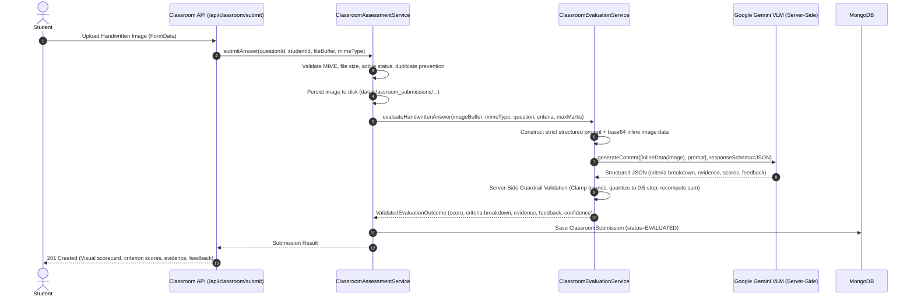

# Research Direction 1: Interactive Classroom Assessment

**Author / Lead Researcher:** Antigravity AI Engineering (Pair Programming with IIIT Hyderabad Team)  
**Research Advisor:** Prof. C. V. Jawahar  
**Branch:** `research/jawahar-1-classroom-assessment`  
**Status:** Multimodal Gemini VLM Evaluator with Server-Side Guardrails Implemented (Research Prototype)

---

## 1. Objective & Research Overview

The goal of this research initiative is to create a lightweight, minimal end-to-end **Interactive Classroom Assessment** mode. In live university classroom settings, a professor poses a single focused question, students solve it on paper, capture/upload a photo of their handwritten response, and the system automatically analyzes and evaluates the submission against the question's rubric, presenting immediate scores and structured feedback.

This research prototype operates as an independent module that avoids disrupting the centralized institute-level exam workflow while reusing the core evaluation, authentication, and scoring building blocks of the platform.

---

## 2. Problem Statement: Why Heuristic / Non-Image Evaluators Were Insufficient

In initial explorations, heuristic or non-image-grounded evaluators suffered from severe critical vulnerabilities:
1. **Lack of Visual Grounding:** Plain text or heuristic evaluators could not actually inspect handwritten cursive strokes, spatial mathematical notation, or diagrams.
2. **False Positives / Default High Marks:** Manual testing demonstrated that arbitrary or empty uploaded images could receive a 10/10 score with generic positive praise ("Excellent work!"), defeating the purpose of an academic assessment tool.
3. **Hallucinated Completeness:** Text-based OCR pipelines often discarded spatial layout, failed on multi-line equations, or silently normalized errors before evaluation.
4. **Lack of Evidence:** Heuristics could not provide criterion-level visual evidence explaining *why* a particular step was awarded or deducted marks.

---

## 3. Multimodal Gemini Evaluation Architecture

To resolve this, we introduced a dedicated multimodal evaluation service: [`src/services/ClassroomEvaluationService.ts`](file:///c:/Users/AARATHISREE/Desktop/IIIT%20Hyd%20-%20Assignment%20Evaluation/Project%20Repo/assignment-evaluator/src/services/ClassroomEvaluationService.ts), backed by Google Gemini Vision Language Models (VLM).



### Key Architectural Invariants:
1. **Direct Visual Inspection:** The actual handwritten image bytes are passed directly to Gemini as an `inlineData` part. The system **never** performs preliminary OCR to plain text.
2. **Strict Server-Side Execution:** All Gemini API keys (`GEMINI_API_KEY`, `GOOGLE_AI_API_KEY`, `GOOGLE_API_KEY`) reside exclusively in server environments and are never exposed to browser clients.
3. **Pluggable & Injectable Caller:** `ClassroomEvaluationService` supports dependency injection (`setGeminiCaller`) for 100% deterministic, offline mock testing without live network calls or flakiness.

---

## 4. Model Inputs & Structured Output

### 4.1 Input Supplied to the Model
The model receives:
- **Handwritten Image Data:** Base64-encoded image buffer with MIME type (`image/png`, `image/jpeg`, `image/webp`).
- **Question Context:** Title and complete question prompt text.
- **Maximum Marks:** Overall question maximum score.
- **Rubric Criteria:** List of criteria names and their respective maximum marks.
- **Academic Grading Instructions:**
  - Inspect the handwritten answer image carefully.
  - Do NOT assume the answer is correct; do NOT award full marks by default.
  - Award marks ONLY for content actually present in the submitted answer.
  - Do NOT infer missing reasoning, calculations, definitions, diagrams, or steps.
  - Evaluate every rubric criterion independently.
  - Give partial marks when only part of a criterion is satisfied; give 0 when not satisfied.
  - If the answer is blank, irrelevant, nonsensical, or does not address the question, award 0.
  - If handwriting is partially unreadable, state that in evidence and reduce confidence/marks.
  - Ground all feedback and evidence strictly in the visible image content.
  - Quantize scores to 0.5 increments.

### 4.2 Structured Output Schema
The model returns a strictly formatted JSON response adhering to the schema:

```json
{
  "criteria": [
    {
      "criterion": "Definition and Formula",
      "maxMarks": 4,
      "awardedMarks": 4,
      "evidence": "Correctly wrote formula and defined all variables."
    },
    {
      "criterion": "Worked Numerical Example",
      "maxMarks": 6,
      "awardedMarks": 3.5,
      "evidence": "Computed intermediate steps correctly but made an arithmetic slip in final calculation."
    }
  ],
  "totalMarks": 7.5,
  "maxMarks": 10,
  "overallFeedback": "Good understanding of the core theory with minor calculation errors.",
  "confidence": 0.88
}
```

---

## 5. Server-Side Score Validation & Guardrails

The evaluation pipeline **does not blindly trust model outputs**. After Gemini responds, `ClassroomEvaluationService.validateAndHarmonizeOutput` enforces the following server-side guardrails:

1. **Criterion Alignment & Boundary Clamping:**
   - Every returned criterion is matched against the professor's configured rubric.
   - `awardedMarks` is clamped between `0` and `criterion.maxMarks`.
   - Missing criteria are automatically assigned `0` with note `"Criterion not evaluated by model"`.
2. **Score Step Quantization (`DEFAULT_SCORE_STEP = 0.5`):**
   - All scores are rounded to the nearest half-point (`Math.round(score * 2) / 2`).
3. **Independent Total Summation:**
   - The final `totalScore` is computed server-side by summing validated criterion marks, preventing model arithmetic drift or hallucinated sums.
4. **Total Max Bound Enforcement:**
   - The final score is strictly capped at `question.maxMarks`.
5. **Confidence Normalization:**
   - Confidence is clamped to `[0.0, 1.0]`.

---

## 6. Failure Handling & Fallback Policy

If Gemini fails (network error, rate limit, timeout, invalid JSON, or unparseable schema):
- **Never Default to 10/10:** The system will **never** assign full marks or emit generic praise on failure.
- **Safe Fallback:** The evaluator emits a controlled evaluation response:
  - `totalMarks = 0`
  - Criterion breakdown with `awardedMarks = 0` and explicit error reason in `evidence`.
  - Actionable feedback indicating automated evaluation could not be completed and instructor manual review is required.
  - `confidence = 0.0`.
- **System Integrity:** The submission is recorded safely with clear error notes rather than crashing the classroom session.

---

## 7. Test Strategy & Test Matrix

The test suite in [`src/__tests__/ClassroomAssessment.test.ts`](file:///c:/Users/AARATHISREE/Desktop/IIIT%20Hyd%20-%20Assignment%20Evaluation/Project%20Repo/assignment-evaluator/src/__tests__/ClassroomAssessment.test.ts) covers 24 rigorous test cases across 6 suites without requiring a live Gemini API connection:

| Test Case | Scenario / Condition | Expected Behavior |
|---|---|---|
| **Scenario A** | Correct answer | High score (10/10) with detailed criterion-level visual evidence. |
| **Scenario B** | Partially correct answer | Partial score (e.g. 5.5/10), avoiding automatic full marks. |
| **Scenario C** | Wrong answer | Low / zero score (e.g. 1/10) noting specific conceptual errors in evidence. |
| **Scenario D** | Irrelevant / unrelated answer | 0/10 score with evidence indicating off-topic submission. |
| **Scenario E** | Blank / empty answer image | 0/10 score with evidence stating page is blank. |
| **Scenario F** | Malformed / invalid Gemini response | Controlled evaluation result (0/10 with manual review flag), never defaulting to 10/10. |
| **Scenario G** | Model returns score exceeding criterion max | Server-side validation clamps criterion score to criterion maxMarks. |
| **Scenario H** | Model total exceeds question maxMarks | Server-side validation prevents total from exceeding question maxMarks. |
| **Scenario I** | Image payload transmission | Verifies raw base64 image data and MIME type are faithfully passed to the VLM caller. |
| **Security & RBAC** | Unauthorized / Cross-student access | Enforces HTTP 401/403 controls on questions, submissions, and image downloads. |
| **Lifecycle** | Question creation & deactivation | Enforces rubric sum validation and single active question invariant. |

---

## 8. Limitations of VLM-Based Handwritten Evaluation

> [!WARNING]
> **Research Prototype Notice:** While the multimodal Gemini evaluator offers strong visual reasoning and grounding, it is an experimental research prototype and is not guaranteed to be 100% accurate across all handwriting styles and document variations.

### Key Practical Limitations:
1. **Severe Handwriting Illegibility:** Extreme cursive, heavy smudging, or low-resolution camera captures can lower model confidence and OCR precision.
2. **Complex Spatial Layouts:** Multi-column scratch work, crossed-out paragraphs, and non-linear side annotations can occasionally challenge reading order determination.
3. **Synchronous Latency:** Evaluating an image with deep VLMs takes 1.5–4.0 seconds. In live classrooms with > 200 concurrent students, asynchronous task queues (e.g., BullMQ/Redis) and batch dispatching are recommended.
4. **Symbolic & Diagrammatic Ambiguity:** Handwritten circuit schematics, geometric proofs, and complex tensor diagrams require specialized multi-modal reasoning prompts or fine-tuned vision heads.

---

## 9. Next Steps & Recommendations

1. **Instructor Live Override:** Provide a 1-click quick-adjust UI on the professor's live submission drawer to override automated scores with manual adjustments if needed.
2. **Confidence-Based Triage:** Automatically flag submissions with `confidence < 0.6` for immediate professor review.
3. **Batch Aggregation & Misconception Heatmaps:** Aggregate criterion scores across all submissions in real-time to generate lecture misconception analytics.
