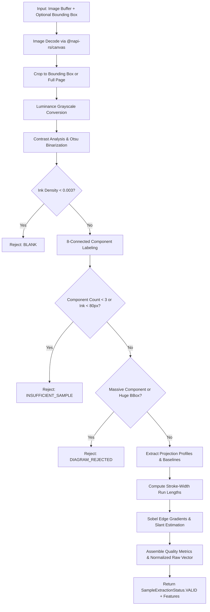

# Research Direction 4: Handwriting Consistency & Identity Verification (Phase 1)

## 1. Objective

Research Direction 4 addresses the challenge of verifying handwriting consistency across student submissions:
- Associating handwritten answer scripts with individual student profiles.
- Constructing an empirical handwriting representation (profile) from verified historical samples.
- Comparing subsequent answer scripts against the student's profile.
- Generating soft investigative flags (`REVIEW_REQUIRED`, `INCONCLUSIVE`) for human review when anomalous variance is detected.

**Phase 1 Focus:**
Phase 1 establishes the mathematical foundation and deterministic document-analysis feature extraction layer (`HandwritingFeatureExtractor.ts`), along with the isolated data models (`HandwritingConsistency.ts`) and deterministic synthetic test fixtures (`HandwritingFixtureGenerator.ts`).

---

## 2. Distinction: Document-Analysis Features vs. Biometric Identity

> [!IMPORTANT]
> **Explicit Architectural Disclaimer**
> Classical image document-analysis features (ink density, horizontal/vertical projection profiles, stroke-width proxies, contour gradient slant) describe geometric and statistical properties of scanned ink on paper.
>
> They do **NOT** constitute biometric identity proof or forensic forensic handwriting identification. Real pen pressure cannot be directly measured from 2D static images without hardware-level digitized stylus transducers; stroke thickness is therefore strictly treated and modeled as an observational proxy (`strokeWidthProxy`) for pen nib geometry and writing weight.
>
> High feature divergence indicates an **investigative anomaly** warranting human instructor or TA review, never an automated accusation of plagiarism or cheating.

---

## 3. Existing Architecture Reused

To maintain strict isolation and prevent regressions in production grading, Phase 1 reuses existing foundational infrastructure without altering production workflows:
1. **`@napi-rs/canvas`**: Used for server-side native canvas rendering, pixel extraction, affine transformations, and image decoding.
2. **MongoDB / Mongoose (`connectDB`)**: Standard document store pattern for schema persistence.
3. **Mongoose Schema & Types Isolation**: All models (`HandwritingSample`, `HandwritingProfile`, `HandwritingComparison`) are strictly isolated in `src/models/HandwritingConsistency.ts`. No modifications are made to `AnswerScript`, `Page`, or `User`.
4. **Normalized Bounding Box System**: Supports arbitrary region cropping using `[0, 1]` normalized coordinates `(x, y, width, height)`.

---

## 4. Feature Definitions & Mathematical Formulations

| Feature | Type / Range | Definition & Extraction Method |
| :--- | :--- | :--- |
| **`inkDensity`** | `[0.0, 1.0]` | Ratio of foreground ink pixels ($I_{fg}$) to total analyzed region pixels ($W \times H$). |
| **`horizontalProjection`** | `{ mean, variance, peakCount }` | Ink pixel distribution along horizontal rows $H(y)$. Evaluates line structure, text line density, and baseline counts via smoothed peak detection. |
| **`verticalProjection`** | `{ mean, variance }` | Ink pixel distribution along vertical columns $V(x)$. Reflects word margins and column formatting. |
| **`estimatedLineSpacing`** | Pixels ($\ge 0$) | Average distance in pixels between detected horizontal baseline peaks. |
| **`strokeWidthProxy`** | `{ mean, variance, median }` | Run-length analysis of consecutive ink segments across scanlines. Observational proxy for pen nib geometry and writing weight. |
| **`slantAngle`** | Degrees `[-45°, +45°]` | Dominant handwriting stroke slant calculated via 2D Sobel gradient operators ($\arctan(G_x, -G_y)$) along ink contour edges. |
| **`connectedComponents`** | `{ count, meanArea, meanAspectRatio }` | 8-connectivity connected component labeling (BFS). Evaluates stroke fragmentation, character sizes, and cluster aspect ratios. |
| **`quality`** | `ISampleQuality` | Evaluates contrast, edge sharpness score, high-frequency noise ratio, sufficiency, blank detection, and diagram rejection. |
| **`rawVector`** | `number[8]` | Normalized 8-element feature vector for downstream distance comparisons: `[inkDensity, hVarianceNorm, vVarianceNorm, lineSpacingNorm, swMeanNorm, swVarNorm, slantNorm, ccAspectNorm]`. |

---

## 5. Extraction Pipeline Architecture

1. **Decoding & Bounding Box**: Image is loaded and cropped to normalized coordinates `(x, y, w, h)`.
2. **Luminance & Otsu**: Evaluates grayscale luminance distribution and computes optimal binarization threshold. Blank detection fires early if ink density $< 0.003$.
3. **Connected Components & Noise**: Identifies 8-connected stroke blobs. Tiny isolated pixels ($area \le 2$) are measured as noise.
4. **Sufficiency Check**: Samples with fewer than 3 stroke components or under 80 ink pixels are disqualified.
5. **Diagram / Non-Text Filtering**: Heuristics detect large geometric shapes or solid fills (e.g., flowcharts, circuits) where a single component comprises $> 40\%$ of total ink, flagging them as `DIAGRAM_REJECTED`.
6. **Projection Profiles**: Calculates row-wise and column-wise projection profiles, smoothed peak baseline detection, and line spacing.
7. **Stroke Width Proxy**: Measures scanline run-lengths through foreground strokes to capture pen nib profile and writing weight.
8. **Slant Angle**: Analyzes directional Sobel gradient vectors along stroke boundaries within $\pm 45^\circ$ of vertical.
9. **Quality & Vector Assembly**: Produces quality diagnostics and an 8-element normalized vector bounded in `[0, 1]`.

---

## 6. Synthetic Test Methodology

To comply with data privacy policies and ensure fully reproducible, deterministic tests, **ZERO real student data** is used. All test fixtures are generated programmatically in `src/__tests__/fixtures/HandwritingFixtureGenerator.ts`:

- **A. Consistent Writer Samples**: Synthetic multi-line cursive handwriting with fixed line spacing, baseline curves, stroke width, and controlled slant shear.
- **B. Significantly Different Slant**: Cursive strokes sheared by varying angles (e.g. $0^\circ$ upright vs $+25^\circ$ forward slant).
- **C. Significantly Different Stroke Width**: Lines rendered with varying stroke widths (e.g. $1.5\text{px}$ thin ballpoint vs $5.0\text{px}$ thick felt tip).
- **D. Insufficient Strokes**: Minimal 1-2 stray marks below threshold.
- **E. Blank Canvas**: Pure white canvas with zero ink pixels.
- **F. Diagram Sample**: Geometric flowchart boxes and connector lines.
- **G. Noisy Scan**: Multi-line cursive text with injected salt-and-pepper noise pixels.
- **H. Rotated Sample**: Whole sample rotated by arbitrary degrees ($8^\circ$).

---

## 7. Limitations

1. **2D Image Limitations**: Static scans cannot record dynamic kinematic properties (writing speed, acceleration, pen lifts, or real-time pen pressure).
2. **Scanner & Resolution Variance**: Scanners with varying DPI or compression artifacts may slightly alter run-length stroke widths; feature normalization mitigates but does not completely eliminate resolution bias.
3. **Diagram Separation**: While solid shapes and large rectangular boxes are detected, intricate handwritten mathematical graphs or mixed text-diagram margins may require bounding-box segmentation.
4. **Stylus vs. Ink Variations**: A student writing with a fountain pen on an exam vs. a fine-point ballpoint on a homework sheet will exhibit natural stroke-width divergence. Downstream models must account for multi-instrument profiles.

---

## 8. Future Work (Phase 2 & Beyond)

1. **Handwriting Profile Builder (`HandwritingProfileService.ts`)**:
   - Aggregate $\ge 3$ verified `HandwritingSample` records for a student.
   - Calculate intra-student feature means ($\mu_k$) and standard deviations ($\sigma_k$).
   - Transition profile status from `PROVISIONAL` to `ESTABLISHED`.
2. **Handwriting Similarity Engine (`HandwritingComparisonService.ts`)**:
   - Compute Mahalanobis or weighted normalized Euclidean distance against the student's profile.
   - Classify into `MATCH`, `REVIEW_REQUIRED`, `INCONCLUSIVE`, or `INSUFFICIENT_SAMPLE`.
3. **Comparison APIs & Review UI**:
   - Teacher/TA interface displaying side-by-side sample overlays and radar chart breakdowns of anomaly factors.
   - ScriptFlag integration with manual override controls for instructors.
