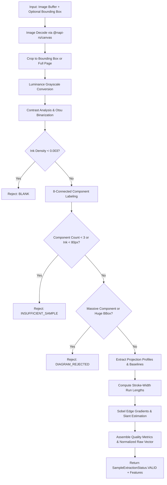
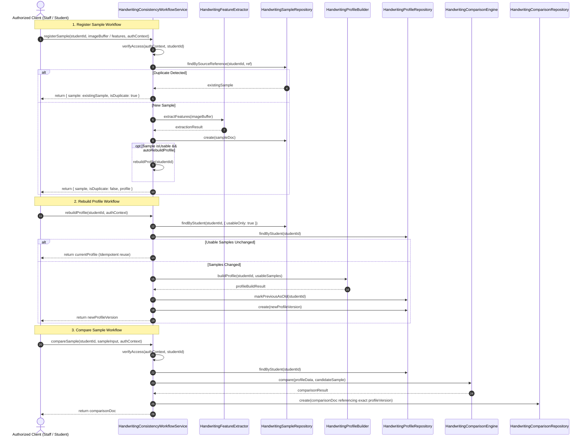
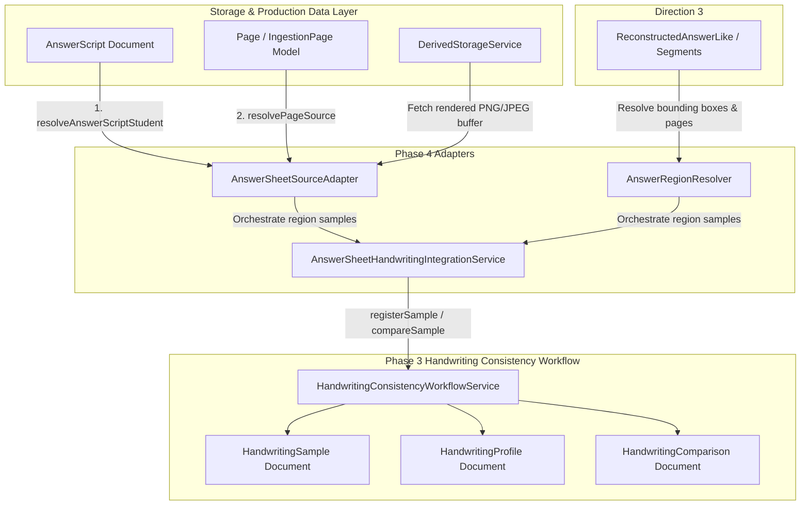

# Research Direction 4: Handwriting Consistency & Identity Verification (Phase 1)

## 1. Objective

Research Direction 4 addresses the challenge of verifying handwriting consistency across student submissions:
- Associating handwritten answer scripts with individual student profiles.
- Constructing an empirical handwriting representation (profile) from verified historical samples.
- Comparing subsequent answer scripts against the student's profile.
- Generating soft investigative flags (`REVIEW_REQUIRED`, `INCONCLUSIVE`) for human review when anomalous variance is detected.

**Phase 1 Focus:**
Phase 1 establishes the mathematical foundation and deterministic document-analysis feature extraction layer (`HandwritingFeatureExtractor.ts`), along with the isolated data models (`HandwritingConsistency.ts`) and deterministic synthetic test fixtures (`HandwritingFixtureGenerator.ts`).

---

## 2. Distinction: Document-Analysis Features vs. Biometric Identity

> [!IMPORTANT]
> **Explicit Architectural Disclaimer**
> Classical image document-analysis features (ink density, horizontal/vertical projection profiles, stroke-width proxies, contour gradient slant) describe geometric and statistical properties of scanned ink on paper.
>
> They do **NOT** constitute biometric identity proof or forensic forensic handwriting identification. Real pen pressure cannot be directly measured from 2D static images without hardware-level digitized stylus transducers; stroke thickness is therefore strictly treated and modeled as an observational proxy (`strokeWidthProxy`) for pen nib geometry and writing weight.
>
> High feature divergence indicates an **investigative anomaly** warranting human instructor or TA review, never an automated accusation of plagiarism or cheating.

---

## 3. Existing Architecture Reused

To maintain strict isolation and prevent regressions in production grading, Phase 1 reuses existing foundational infrastructure without altering production workflows:
1. **`@napi-rs/canvas`**: Used for server-side native canvas rendering, pixel extraction, affine transformations, and image decoding.
2. **MongoDB / Mongoose (`connectDB`)**: Standard document store pattern for schema persistence.
3. **Mongoose Schema & Types Isolation**: All models (`HandwritingSample`, `HandwritingProfile`, `HandwritingComparison`) are strictly isolated in `src/models/HandwritingConsistency.ts`. No modifications are made to `AnswerScript`, `Page`, or `User`.
4. **Normalized Bounding Box System**: Supports arbitrary region cropping using `[0, 1]` normalized coordinates `(x, y, width, height)`.

---

## 4. Feature Definitions & Mathematical Formulations

| Feature | Type / Range | Definition & Extraction Method |
| :--- | :--- | :--- |
| **`inkDensity`** | `[0.0, 1.0]` | Ratio of foreground ink pixels ($I_{fg}$) to total analyzed region pixels ($W \times H$). |
| **`horizontalProjection`** | `{ mean, variance, peakCount }` | Ink pixel distribution along horizontal rows $H(y)$. Evaluates line structure, text line density, and baseline counts via smoothed peak detection. |
| **`verticalProjection`** | `{ mean, variance }` | Ink pixel distribution along vertical columns $V(x)$. Reflects word margins and column formatting. |
| **`estimatedLineSpacing`** | Pixels ($\ge 0$) | Average distance in pixels between detected horizontal baseline peaks. |
| **`strokeWidthProxy`** | `{ mean, variance, median }` | Run-length analysis of consecutive ink segments across scanlines. Observational proxy for pen nib geometry and writing weight. |
| **`slantAngle`** | Degrees `[-45°, +45°]` | Dominant handwriting stroke slant calculated via 2D Sobel gradient operators ($\arctan(G_x, -G_y)$) along ink contour edges. |
| **`connectedComponents`** | `{ count, meanArea, meanAspectRatio }` | 8-connectivity connected component labeling (BFS). Evaluates stroke fragmentation, character sizes, and cluster aspect ratios. |
| **`quality`** | `ISampleQuality` | Evaluates contrast, edge sharpness score, high-frequency noise ratio, sufficiency, blank detection, and diagram rejection. |
| **`rawVector`** | `number[8]` | Normalized 8-element feature vector for downstream distance comparisons: `[inkDensity, hVarianceNorm, vVarianceNorm, lineSpacingNorm, swMeanNorm, swVarNorm, slantNorm, ccAspectNorm]`. |

---

## 5. Extraction Pipeline Architecture



1. **Decoding & Bounding Box**: Image is loaded and cropped to normalized coordinates `(x, y, w, h)`.
2. **Luminance & Otsu**: Evaluates grayscale luminance distribution and computes optimal binarization threshold. Blank detection fires early if ink density $< 0.003$.
3. **Connected Components & Noise**: Identifies 8-connected stroke blobs. Tiny isolated pixels ($area \le 2$) are measured as noise.
4. **Sufficiency Check**: Samples with fewer than 3 stroke components or under 80 ink pixels are disqualified.
5. **Diagram / Non-Text Filtering**: Heuristics detect large geometric shapes or solid fills (e.g., flowcharts, circuits) where a single component comprises $> 40\%$ of total ink, flagging them as `DIAGRAM_REJECTED`.
6. **Projection Profiles**: Calculates row-wise and column-wise projection profiles, smoothed peak baseline detection, and line spacing.
7. **Stroke Width Proxy**: Measures scanline run-lengths through foreground strokes to capture pen nib profile and writing weight.
8. **Slant Angle**: Analyzes directional Sobel gradient vectors along stroke boundaries within $\pm 45^\circ$ of vertical.
9. **Quality & Vector Assembly**: Produces quality diagnostics and an 8-element normalized vector bounded in `[0, 1]`.

---

## 6. Synthetic Test Methodology

To comply with data privacy policies and ensure fully reproducible, deterministic tests, **ZERO real student data** is used. All test fixtures are generated programmatically in `src/__tests__/fixtures/HandwritingFixtureGenerator.ts`:

- **A. Consistent Writer Samples**: Synthetic multi-line cursive handwriting with fixed line spacing, baseline curves, stroke width, and controlled slant shear.
- **B. Significantly Different Slant**: Cursive strokes sheared by varying angles (e.g. $0^\circ$ upright vs $+25^\circ$ forward slant).
- **C. Significantly Different Stroke Width**: Lines rendered with varying stroke widths (e.g. $1.5\text{px}$ thin ballpoint vs $5.0\text{px}$ thick felt tip).
- **D. Insufficient Strokes**: Minimal 1-2 stray marks below threshold.
- **E. Blank Canvas**: Pure white canvas with zero ink pixels.
- **F. Diagram Sample**: Geometric flowchart boxes and connector lines.
- **G. Noisy Scan**: Multi-line cursive text with injected salt-and-pepper noise pixels.
- **H. Rotated Sample**: Whole sample rotated by arbitrary degrees ($8^\circ$).

---

## 7. Limitations

1. **2D Image Limitations**: Static scans cannot record dynamic kinematic properties (writing speed, acceleration, pen lifts, or real-time pen pressure).
2. **Scanner & Resolution Variance**: Scanners with varying DPI or compression artifacts may slightly alter run-length stroke widths; feature normalization mitigates but does not completely eliminate resolution bias.
3. **Diagram Separation**: While solid shapes and large rectangular boxes are detected, intricate handwritten mathematical graphs or mixed text-diagram margins may require bounding-box segmentation.
4. **Stylus vs. Ink Variations**: A student writing with a fountain pen on an exam vs. a fine-point ballpoint on a homework sheet will exhibit natural stroke-width divergence. Downstream models must account for multi-instrument profiles.

---

## 8. Phase 2: Multi-Sample Profile Construction & Comparison Engine

Phase 2 builds upon the feature extraction pipeline established in Phase 1 to construct empirical multi-sample student handwriting profiles (`HandwritingProfileBuilder.ts`) and evaluate new submissions via a deterministic handwriting comparison engine (`HandwritingComparisonEngine.ts`).

### 8.1 Profile Construction & Minimum Sample Count

A student handwriting profile represents empirical baseline statistics constructed from verified historical handwritten submissions.

- **Candidate Sample Processing**: Input samples may be supplied as raw image buffers (which are processed through `HandwritingFeatureExtractor`) or as validated pre-extracted feature objects.
- **Sample Quality Filtering**: Any sample that fails validation (status `BLANK`, `INSUFFICIENT_SAMPLE`, `DIAGRAM_REJECTED`, or `ERROR`) is excluded from profile statistics and recorded under `rejectedSamples`.
- **Minimum Sample Count Rules**:
  - **Fewer than 3 valid samples ($N < 3$)**: Status is set to `PROVISIONAL`. Intra-writer natural variance cannot yet be reliably established; comparison against a provisional profile yields `INSUFFICIENT_SAMPLE`.
  - **3 or more valid samples ($N \ge 3$)**: Status transitions to `ESTABLISHED`. Intra-writer feature statistics are considered sufficient for consistency assessment.
- **Traceability Metadata**: The profile preserves sample identifiers (`samplesUsed`) and sample metadata (`sampleMetadata`) indicating source answer scripts, page numbers, extraction timestamps, and quality metrics to allow full auditability.
- **Immutability**: Profile construction never mutates original sample inputs or database documents.

### 8.2 Feature Statistics Formulation

For $N$ accepted samples with 8-element normalized feature vectors $v_j \in [0, 1]^8$ ($j = 1 \dots N$):

1. **Feature Means ($\mu_k$)**:
   $$\mu_k = \frac{1}{N} \sum_{j=1}^N v_{j, k} \quad \text{for } k \in \{0, \dots, 7\}$$
   Rounded to 4 decimal places for deterministic precision.

2. **Feature Standard Deviations ($\sigma_k$)**:
   - For $N = 1$: Standard deviation cannot be computed across multiple samples and defaults to $0.0000$.
   - For $N \ge 2$: Calculated using Bessel-corrected sample standard deviation:
     $$s_k = \sqrt{\frac{1}{N - 1} \sum_{j=1}^N (v_{j, k} - \mu_k)^2}$$
     (Population standard deviation with denominator $N$ is optionally supported via builder configuration).
   - Near-zero variance handling: If all samples have identical feature values, $\sigma_k = 0.0000$. Safe floors prevent numerical instability downstream.

### 8.3 Comparison Method & Distance Calculation

When a new handwriting sample is evaluated against an established profile:

1. **Validation & Extraction**: The new sample is verified. If poor-quality or invalid (blank, diagram, insufficient strokes), the comparison terminates early with `UNASSESSED`.
2. **Baseline Sufficiency Check**: If the profile has fewer than 3 samples or is `PROVISIONAL`, the engine returns `INSUFFICIENT_SAMPLE`.
3. **Variance-Normalized Deviations ($z_k$)**:
   To prevent division-by-zero or excessive score magnification from near-zero baseline variance, an effective standard deviation floor ($\sigma_{\text{floor}} = 0.02$) is enforced:
   $$\sigma_{\text{eff}, k} = \max(\sigma_k, \sigma_{\text{floor}})$$
   $$z_k = \frac{|x_k - \mu_k|}{\sigma_{\text{eff}, k}}$$
4. **Multi-Feature Soft-Capped Distance**:
   To ensure that a single unusual feature cannot disproportionately force an anomalous outcome, each feature's divergence component is bounded:
   $$c_k = \min\left(1.0, \frac{|x_k - \mu_k|}{3 \cdot \sigma_{\text{eff}, k}}\right)$$
   The aggregate distance is computed as the root-mean-square of these bounded components:
   $$D = \sqrt{\frac{1}{8} \sum_{k=0}^7 c_k^2} \in [0.0, 1.0]$$
5. **Feature Contribution Ranking**:
   Each feature's squared standardized divergence contributes to total divergence:
   $$\text{contribution}_k = \frac{z_k^2}{\sum_{j=0}^7 z_j^2}$$
   Features are sorted in descending order of contribution with alphabetical tie-breaking to guarantee deterministic ranking.
6. **Confidence Scoring**:
   Confidence combines baseline profile maturity with the new sample's image quality metrics:
   $$C = C_{\text{samples}} \times C_{\text{quality}}$$
   $$C_{\text{samples}} = \min(1.0, 0.5 + 0.1 \times N)$$
   $$C_{\text{quality}} = \min(1.0, \text{contrast} \times 0.6 + \text{sharpness} \times 0.4) \times (1.0 - \text{noiseRatio})$$

### 8.4 Comparison Result States & Semantics

| Result State | Semantic Definition | Trigger Conditions |
| :--- | :--- | :--- |
| **`MATCH`** | New sample is consistent with the established baseline profile. | $D \le 0.38$, deviating features $< 2$, and confidence $\ge 0.45$. |
| **`REVIEW_REQUIRED`** | Multiple meaningful deviations from baseline profile indicate manual verification is warranted. | $\ge 2$ features with $z_k \ge 2.5$ (and $|x_k - \mu_k| \ge 0.04$) AND $D \ge 0.50$. |
| **`INSUFFICIENT_SAMPLE`** | Insufficient baseline samples to establish a reliable baseline profile. | Profile has $< 3$ valid baseline samples or is `PROVISIONAL`. |
| **`INCONCLUSIVE`** | Evidence is ambiguous, internally inconsistent, or confidence is degraded. | Single isolated feature deviation with elevated distance, or $D$ between thresholds, or confidence $< 0.45$. |
| **`UNASSESSED`** | Comparison could not be meaningfully performed. | New sample is blank, diagram-heavy, insufficient strokes, or decode failed. |

> [!NOTE]
> Under no circumstances does the engine report "Plagiarism" or "Cheating". Results strictly represent objective geometric consistency and anomaly evidence for human verification.

### 8.5 Provisional Engineering Thresholds

All thresholds are centralized in `DEFAULT_COMPARISON_THRESHOLDS` and fully configurable via constructor injection:

```typescript
export const DEFAULT_COMPARISON_THRESHOLDS: HandwritingComparisonThresholds = {
    minBaselineSamples: 3,
    minStdDevFloor: 0.02,
    matchDistanceThreshold: 0.38,
    reviewDistanceThreshold: 0.50,
    featureDeviationZThreshold: 2.5,
    minAbsoluteDiff: 0.04,
    minDeviatingFeaturesForReview: 2,
    minConfidenceThreshold: 0.45
};
```

> [!WARNING]
> **Provisional Engineering Status & Calibration Requirement**
> These thresholds are provisional engineering heuristics configured for deterministic unit tests and pipeline validation. They are **NOT** scientifically or forensically validated biometric cutoffs.
> Real-world deployment requires calibration on verified, multi-institution handwriting corpora across varied writing instruments (ballpoint, fountain, gel, pencil) and scanner resolutions (150–600 DPI).

### 8.6 Limitations

1. **Instrument Variance**: Writing with a thick marker vs. a micro-point pen causes natural stroke-width shifts. Multiple writing instruments per student should ideally be tracked across distinct instrument clusters.
2. **Postural & Fatigue Variation**: Student handwriting naturally deteriorates over long multi-hour examinations; slant and line spacing variance increases toward the end of an exam script.
3. **Absence of Real Pressure Transducers**: Scans measure optical ink absorption and run-length stroke thickness, not kinematic stylus pressure.
4. **Single-Feature Robustness**: An isolated change (e.g. changing slant due to desk angle) must not flag a student; multi-feature corroboration is strictly required.

### 8.7 Transition to Phase 3 Persistence

With the mathematical models and deterministic comparison engines established in Phase 1 and Phase 2, Phase 3 introduces the persistent data layer, explicit profile versioning, and secure student-scoped workflow orchestration.

---

## 9. Phase 3: Persistent Handwriting Sample, Profile, and Comparison Workflow

> [!IMPORTANT]
> **Production Isolation Disclaimer**
> Phase 3 implements a research-only persistence and workflow orchestration backend. It does **NOT** alter the production grading pipeline, `AnswerScript`, `Allocation`, `Grade`, or `ScriptFlag` behaviors, and does not introduce production grading API endpoints or frontend UI components.

### 9.1 Persisted Handwriting Sample Representation (`HandwritingSample.ts`)

Each analyzed handwriting region is persisted as an independent `HandwritingSamplePersistence` document:
- **`student`**: Foreign key to `User` model, strictly indexed.
- **`sourceReference`**: Optional unique identifier (e.g. `script_id:page_num`) enabling deterministic duplicate detection.
- **`sampleType`**: Classification tag (`EXAM_SCRIPT`, `HOMEWORK`, `BASELINE_UPLOAD`, `GENERAL_SUBMISSION`).
- **`isUsable`**: Boolean flag indicating whether the sample meets quality thresholds (`status === VALID && quality.isSufficient`) to contribute to baseline profile statistics.
- **`rawVector`**: 8-element normalized numerical feature vector (stored only when valid).
- **`quality`**: Contrast, sharpness score, noise ratio, and stroke count metadata.
- **`extractionVersion`**: Version string (`1.0.0`) tracking pipeline feature definitions.

### 9.2 Storage Boundary (No Raw Bytes in Mongo)

In accordance with architectural storage policies, raw image buffers are **never** stored directly in MongoDB documents:
- Source images are managed by existing project storage infrastructure (`ImmutableStorageService` or derived storage paths).
- Handwriting documents store solely metadata, source references, bounding box coordinates, and extracted mathematical feature vectors.

### 9.3 Profile Persistence & Explicit Versioning (`HandwritingProfile.ts`)

To prevent historical comparisons from having their evidentiary basis silently altered when a student submits new work, handwriting profiles utilize **strict immutable versioning**:
- **`profileVersion`**: Integer version counter ($1, 2, 3, \dots$).
- **`isCurrent`**: Boolean flag marking the latest active version.
- **`{ student: 1, profileVersion: 1 }`**: Unique compound index guaranteeing that historical versions are preserved and can never be overwritten.
- **Versioning Strategy**:
  - While sample count $< 3$ (`PROVISIONAL`), the provisional profile remains Version 1 and is updated in place.
  - Upon reaching $\ge 3$ valid samples, the profile transitions to `ESTABLISHED` as **Version 1**.
  - Subsequent addition of valid samples (e.g. sample 4) automatically increments to **Version 2**, marking Version 1 as `isCurrent = false`.
  - Rebuilding without adding or removing usable samples is idempotent and reuses the existing profile version.

### 9.4 Comparison Persistence (`HandwritingComparison.ts`)

Each comparison event is recorded immutably:
- **`student`**: Student identity.
- **`profile` & `profileVersion`**: Exact foreign key and integer version of the profile against which the sample was compared.
- **`sample`**: Foreign key to the evaluated candidate sample document.
- **`status`**: Outcome state (`MATCH`, `REVIEW_REQUIRED`, `INSUFFICIENT_SAMPLE`, `INCONCLUSIVE`, `UNASSESSED`).
- **`distance` & `confidence`**: Numerical distance and quality-derived confidence score.
- **`featureDeviations`**: Feature-level breakdown of baseline means, standard deviations, observed values, normalized deviations, and contribution shares.
- **`anomalyFactors`**: Explanatory diagnostic strings.
- **Historical Immutability**: Historical comparison records are never updated when later profile versions are generated.

### 9.5 Workflow Orchestration (`HandwritingConsistencyWorkflowService.ts`)

The workflow service orchestrates end-to-end processing across three primary actions:



### 9.6 Security & Student Privacy

- **Student Isolation**: All repository queries and service methods strictly enforce `studentId` scoping.
- **Role-Based Authorization (`HandwritingAuthContext`)**:
  - `STUDENT`: May **only** access their own profile, samples, and comparisons (`userId === studentId`). Accessing another student's ID immediately returns `403 Forbidden`.
  - `PROFESSOR`, `ADMIN`, `TA`, `SYSTEM`: Explicitly authorized staff roles permitted to audit student handwriting data.
- **Fail-Closed Validation**: Invalid ObjectId formats (non-24 hex characters) are rejected with `400 Bad Request`.
- **Data Protection**: Handwriting feature vectors and comparison records are never leaked across student boundaries.

### 9.7 Transaction and Consistency Model

- Multi-document operations (profile deprecation + new version creation) execute within MongoDB sessions and transactions where the topology supports it (Replica Sets, Sharded clusters).
- On standalone environments (such as in-memory test databases), operations execute sequentially with fail-safe rollback logic to prevent profile destruction on error.

### 9.8 Research-Only Integrity Disclaimer

The system never issues automated accusations of "Plagiarism" or "Cheating". All outputs are restricted to objective geometric and statistical divergence states (`MATCH`, `REVIEW_REQUIRED`, `INSUFFICIENT_SAMPLE`, `INCONCLUSIVE`, `UNASSESSED`) intended solely to support human instructor oversight.

---

## 10. Phase 4: Real Answer-Sheet Handwriting Integration

> [!IMPORTANT]
> **Production Isolation & Calibration Disclaimer**
> Phase 4 connects the existing persistent handwriting consistency workflow to actual stored/rendered answer-sheet pages and segmented answer regions. It strictly reuses existing infrastructure (`DerivedStorageService`, `Page`, `IngestionPage`, `AnswerScript`) without duplicating storage or rendering logic.
>
> **"Real production handwriting samples have not yet been calibrated."**
> Document-analysis features (ink density, projection variances, stroke-width proxies, contour gradient slant) describe geometric properties of digitized ink and do **NOT** claim biometric accuracy or forensic identity proof. All decision thresholds remain provisional engineering heuristics subject to human instructor oversight.

### 10.1 Architecture Overview

Phase 4 introduces three isolated, research-only adapters/services in `src/services/handwriting/`:



### 10.2 Trusted Student Identity Resolution (`AnswerSheetSourceAdapter`)

To prevent spoofing or unauthorized access, student identity **MUST** originate from the trusted `AnswerScript` record in the database:
- **`resolveAnswerScriptStudent(answerScriptId, expectedStudentId?)`**:
  - Queries `AnswerScript` by ID.
  - Verifies `identificationStatus === IdentificationStatus.IDENTIFIED` and ensures `script.student` is populated.
  - If `identificationStatus !== IDENTIFIED` or student reference is missing, fails safely with HTTP 422 (`Unprocessable Entity: AnswerScript is not yet identified to a student`). Never creates fallback or synthetic student identities.
  - If a client or calling routine supplies an `expectedStudentId`, it is strictly verified against `script.student._id`. If they do not match, the adapter throws HTTP 403 (`Forbidden: Supplied student does not match trusted AnswerScript student`), preventing arbitrary student ID overrides.

### 10.3 Physical Page & Image Source Resolution

Rendered page images are resolved using existing project storage without introducing secondary storage or file-system duplication:
- **`resolvePageSource(answerScriptId, pageNumber)`**:
  - Locates the corresponding `Page` record for the `answerScript` and `pageNumber`. If not yet migrated or created, falls back to `IngestionPage` associated with the script's `batchId` and `fileIndex`.
  - Retrieves the high-resolution image buffer directly through `DerivedStorageService.readDerivedPage(pageDoc.imagePath)`.
  - Returns:
    - `answerScriptId`
    - `studentId`
    - `pageId`
    - `pageNumber`
    - `sourceReference`
    - `imageBuffer`
    - `sourceMetadata` (dimensions, mimeType, storageKey)

### 10.4 Answer Region Resolution & Direction 3 Integration (`AnswerRegionResolver`)

Student handwriting is extracted from specific answer regions rather than entire pages:
- **`resolveRegions(options)`**:
  - Segments pages into targeted answer regions using normalized bounding boxes `IBoundingBox = { x, y, width, height }` with coordinates in `[0, 1]`.
  - Validates bounding boxes: coordinates must fall within `[0, 1]`, and width/height must be strictly positive.
  - **Explicit Failure Handling**: If a region cannot be confidently resolved (invalid box, missing coordinates, or confidence score of 0), the resolver returns `{ resolved: false, unresolvedReason: '...' }`. The system **NEVER** silently falls back to using the whole page as a proxy.
- **Direction 3 `ReconstructedAnswer` Support**:
  - `resolveReconstructedAnswerRegions(answerScriptId, reconstructedAnswer)` accepts reconstructed answer structures from Direction 3 (`segments: Array<{ pageNumber, box, confidence? }>`).
  - Converts each segment into a resolved answer region referencing the associated `questionNumber` and `subQuestion`.

### 10.5 Multi-Page Answers & Multiple Answers Per Page

1. **Multi-Page Answers (Continuation Segments)**:
   - When an answer spans multiple pages (e.g. Q1 on Page 1 and continuation on Page 7), the resolver treats each segment as an independent `IResolvedAnswerRegion`.
   - The integration service extracts handwriting features independently from each physical region without stitching synthetic composite images.
   - All continuation regions retain the exact same `answerScriptId`, `studentId`, and `questionNumber`.
2. **Multiple Answers on One Page**:
   - If a page contains multiple answers (e.g. Q1 top half, Q2 bottom half), bounding boxes ensure each region is cropped and processed in isolation.
   - The integration service guarantees distinct samples are created with unique source references, ensuring ink from different questions does not bleed together.

### 10.6 Handwriting Sample Adapter & Workflow Orchestration (`AnswerSheetHandwritingIntegrationService`)

- **Deterministic Source References**:
  Every resolved region receives a deterministic source reference:
  `script_${answerScriptId}_p${pageNumber}_q${qNum}_${subQ}_r${regionId}_b${x}_${y}_${w}_${h}`
  Processing the same region multiple times is completely idempotent and deduplicated by `HandwritingConsistencyWorkflowService.registerSample()`.
- **Baseline Registration Flow**:
  `processAnswerScriptRegionsForBaseline()` takes resolved answer regions from an identified script, registers each through `HandwritingConsistencyWorkflowService`, and updates the student's baseline profile if the sample is usable.
- **Comparison Flow**:
  `compareAnswerScriptRegion()` evaluates a candidate answer region against the student's existing profile:
  - If the student has $< 3$ usable baseline samples, returns `INSUFFICIENT_SAMPLE`. No synthetic baseline is manufactured.
  - If the candidate region is poor quality (blank, insufficient strokes, diagram), the quality result is preserved and comparison returns `UNASSESSED`.
  - If an established profile exists, computes multi-feature divergence and persists an immutable `HandwritingComparison` record referencing the exact `profileVersion`.
- **Direction 3 Reconstructed Answer Comparison**:
  `compareReconstructedAnswer()` evaluates all segments of a reconstructed question and returns segment-by-segment comparisons.

### 10.7 Source Traceability & Security Invariants

- **Full Provenance Traceability**:
  Every generated `HandwritingSample` references `answerScriptId`, `pageNumber`, `boundingBox`, `sourceReference`, and pipeline `extractionVersion` (`1.0.0`).
- **Profile Version Immutability**:
  Historical comparisons remain tied to the specific `profileVersion` active at comparison time; subsequent additions to baseline increment version numbers without mutating past records.
- **Strict Role-Based Authorization**:
  All operations require an authorized `HandwritingAuthContext`. Students cannot register or inspect handwriting data of other students (enforced with HTTP 403).

### 10.8 Limitations & Future Work

1. **Uncalibrated Feature Thresholds**: As noted, current distance ($0.38 / 0.50$) and $z$-score ($2.5$) thresholds are engineering defaults that must be calibrated against real academic handwriting datasets across diverse writing instruments.
2. **Scanner Artifacts & Resolution**: Variations in scanner DPI, compression noise, and contrast can slightly alter stroke-width proxies. Normalization reduces this effect, but consistent scanning standards are recommended.
3. **No Forensic or Biometric Claims**: Features reflect geometric surface statistics, not forensic biometric identification. Outputs serve strictly as human decision support (`REVIEW_REQUIRED`), never automated penalty.
