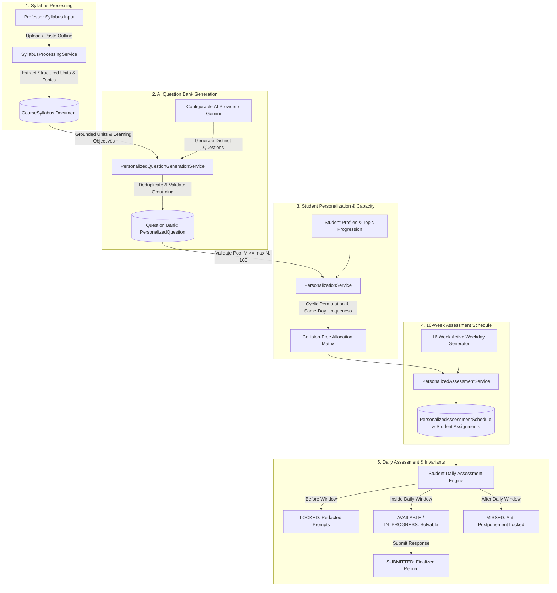

# Research Direction 2: Student Login + Personalized Assessment

**Author / Lead Researcher:** Antigravity AI Engineering (Pair Programming with IIIT Hyderabad Team)  
**Research Advisor:** Prof. C. V. Jawahar  
**Branch:** `research/jawahar-2-personalized-assessment`  
**Status:** Complete Working Architecture with Syllabus-Driven Question Generation, Student Personalization, Mathematical Allocation Invariants, and Anti-Postponement Guards

---

## 1. Architectural Distinction & Overview

The Personalized Assessment system provides continuous, individualized learning grounded directly in the professor's semester syllabus.

The system clearly distinguishes seven core architectural phases:

---

## 2. Core Concepts & Subsystems

### 1. Syllabus-Driven Question Generation
- Rather than relying on hardcoded benchmark questions, the professor provides the actual semester syllabus for a course.
- `SyllabusProcessingService` parses the syllabus into structured units/modules, topics, and learning objectives.
- The syllabus is stored in the `CourseSyllabus` model linked to the course.

### 2. Question Bank & Pool Capacity Sizing
- `PersonalizedQuestionGenerationService` generates questions that are strictly grounded in the syllabus units.
- **Pool Capacity Requirement:**
  Each student receives 100 distinct questions.
  To guarantee that on any given day no two students receive the same question across a cohort of $N$ students, the question pool size $M$ must satisfy:
  $$M \ge \max(N, 100)$$
- Generated questions are deduplicated, validated against the syllabus topic set, and assigned balanced difficulty levels (EASY, MEDIUM, HARD).

### 3. AI Provider Configuration Boundary
- AI question generation utilizes `IAIQuestionGenerationProvider`.
- **External Configuration Rule:**
  - AI API keys (e.g. `GEMINI_API_KEY`) are configured strictly via environment variables.
  - No keys are hardcoded in source code.
  - If the AI provider is not configured, the service returns a structured 503 error (`AI_NOT_CONFIGURED`) with a helpful setup message instead of crashing or generating dummy data.

### 4. Student Personalization
- `PersonalizationService` maintains student learning profiles (strengths, completed topics, streaks).
- Personalizes the 100-question sequence along a difficulty progression curve while mapping syllabus modules.

### 5. Same-Day Uniqueness (Collision-Free Invariant)
- For every assessment day $d \in [1 \dots 100]$:
  $$\forall s_i \neq s_j \implies \text{Question}(s_i, d) \neq \text{Question}(s_j, d)$$
- Every student $s_i$ receives exactly 100 unique questions with 0 repeats over the 16-week period.

### 6. 16-Week Scheduling & Daily Window
- 100 daily slots are computed across active weekdays within a 16-week envelope.
- Daily availability window (e.g., 09:00 to 22:00) enforces consistent daily pace.

### 7. Strict Anti-Postponement
- Questions cannot be unlocked in advance.
- Uncompleted questions whose daily window expires are permanently marked `MISSED` and cannot be reopened.

---

## 3. Data Models

1. **`CourseSyllabus`** ([`src/models/CourseSyllabus.ts`](file:///c:/Users/AARATHISREE/Desktop/IIIT%20Hyd%20-%20Assignment%20Evaluation/Project%20Repo/assignment-evaluator/src/models/CourseSyllabus.ts)): Stores extracted units, topics, raw syllabus text, and learning objectives per course.
2. **`PersonalizedQuestion`** ([`src/models/PersonalizedQuestion.ts`](file:///c:/Users/AARATHISREE/Desktop/IIIT%20Hyd%20-%20Assignment%20Evaluation/Project%20Repo/assignment-evaluator/src/models/PersonalizedQuestion.ts)): Stores question prompt, topic, unit, difficulty, expected concepts, hints, reference answer, and rubric criteria.
3. **`PersonalizedAssessmentSchedule`** ([`src/models/PersonalizedAssessmentSchedule.ts`](file:///c:/Users/AARATHISREE/Desktop/IIIT%20Hyd%20-%20Assignment%20Evaluation/Project%20Repo/assignment-evaluator/src/models/PersonalizedAssessmentSchedule.ts)): Stores 16-week schedule configuration, enrolled students, daily window, and pool references.
4. **`PersonalizedStudentAssignment`** ([`src/models/PersonalizedStudentAssignment.ts`](file:///c:/Users/AARATHISREE/Desktop/IIIT%20Hyd%20-%20Assignment%20Evaluation/Project%20Repo/assignment-evaluator/src/models/PersonalizedStudentAssignment.ts)): Stores individual student daily assignments, dynamic state, submitted answers, and timestamp records.

---

## 4. API Endpoints

| Method | Route | Description | Role Required |
|---|---|---|---|
| `POST` | `/api/personalized/syllabus` | Upload & extract structured syllabus | `PROFESSOR`, `ADMIN` |
| `GET` | `/api/personalized/syllabus?courseId=...` | Retrieve course syllabus metadata | Authenticated |
| `POST` | `/api/personalized/questions/generate` | Generate syllabus-grounded questions with AI | `PROFESSOR`, `ADMIN` |
| `GET` | `/api/personalized/questions?courseId=...` | Retrieve question bank for course | Authenticated |
| `POST` | `/api/personalized/questions` | Single or bulk create questions | `PROFESSOR`, `ADMIN` |
| `POST` | `/api/personalized/schedules` | Create & activate 16-week personalized schedule | `PROFESSOR`, `ADMIN` |
| `GET` | `/api/personalized/schedules` | List active schedules | `PROFESSOR`, `ADMIN` |
| `GET` | `/api/personalized/schedules/[id]/progress` | Cohort progress & roster tracking | `PROFESSOR`, `ADMIN` |
| `GET` | `/api/personalized/today` | Fetch student's daily assignment & dynamic status | `STUDENT` |
| `POST` | `/api/personalized/today/start` | Mark today's question as in-progress | `STUDENT` |
| `POST` | `/api/personalized/today/submit` | Submit answer within active daily window | `STUDENT` |
| `GET` | `/api/personalized/my-schedule` | Full 100-slot visual journey & streak statistics | `STUDENT` |

---

## 5. Validation and Testing

All unit, service, invariant, and integration tests in [`src/__tests__/PersonalizedAssessment.test.ts`](file:///c:/Users/AARATHISREE/Desktop/IIIT%20Hyd%20-%20Assignment%20Evaluation/Project%20Repo/assignment-evaluator/src/__tests__/PersonalizedAssessment.test.ts) pass consistently:
- Syllabus upload, validation, and unit extraction
- AI provider configuration guard (503 when unconfigured)
- Grounded question generation and deduplication
- Insufficient question pool capacity validation
- Student learning profile retrieval
- 50 students $\times$ 100 slots zero-collision invariant
- Same-day uniqueness and 100 distinct questions per student
- Daily window lifecycle (LOCKED $\rightarrow$ AVAILABLE $\rightarrow$ IN_PROGRESS $\rightarrow$ SUBMITTED / MISSED)
- Anti-postponement permanent locking of expired slots
- Cross-student privacy isolation and authorization guards
